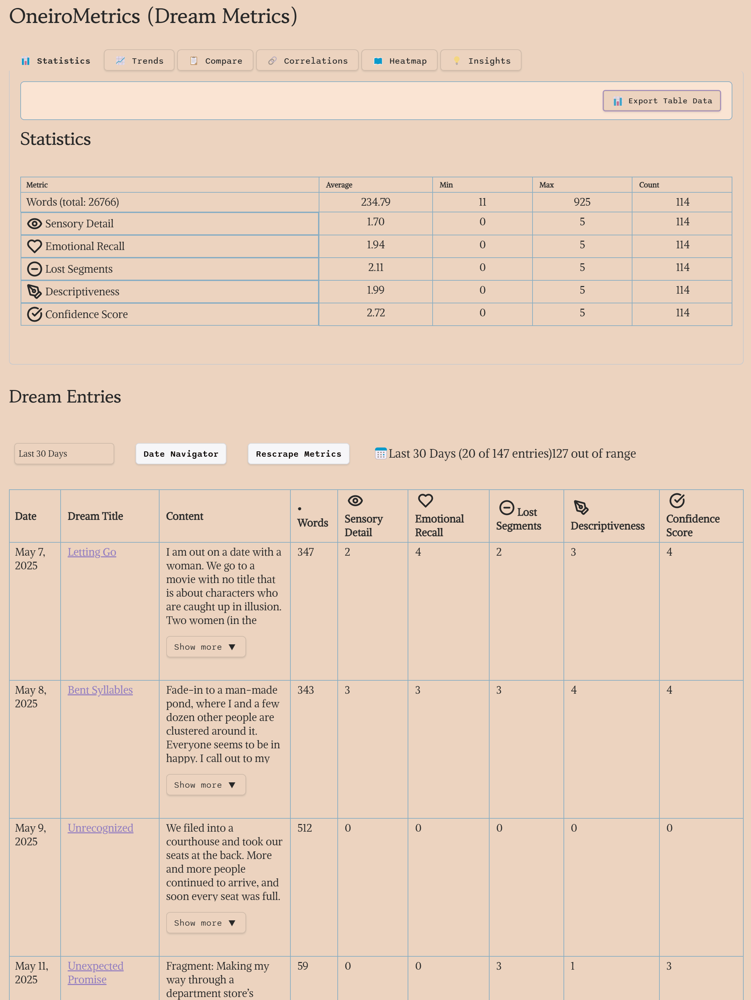

## OneiroMetrics

> **Track, analyze, and visualize your dream journal metrics in Obsidian.**

<p align="center">
  
</p>
<p align="center"><em>"Barn at Sunrise" by Gary Armstrong, inspiration for OneiroMetrics</em></p>

---

### Table of Contents

- [OneiroMetrics Hub](#oneirometrics-hub)
- [OneiroMetrics Note](#oneirometrics-note)
- [Quick Start](#quick-start)
- [Usage](#usage)
- [Settings](#settings)
- [Documentation](#documentation)
- [Support](#support)
- [License](#license)

---

## OneiroMetrics Hub

Access all plugin features through the main hub interface:

- **Dream Scrape:** Extract and analyze metrics from your dream journal entries
- **Metrics Settings:** Configure custom metrics, scoring systems, and display preferences
- **Journal Structure:** Validate and maintain consistent dream journal entry formats
- **Templates:** Create and manage dream journal templates with dynamic placeholders

## OneiroMetrics Note

Your centralized dashboard for dream analysis and insights:

- **Summary Statistics:** Overview of metrics averages, ranges, and entry counts
- **Interactive Charts:** Multiple visualization tabs (Statistics, Trends, Compare, Correlations, Heatmap, Insights)
- **Advanced Analytics:** Trend analysis, outlier detection, correlation analysis, and pattern recognition
- **Data Export:** Export charts and data in CSV format with complete statistical metadata
- **Dream Entries Table:** Sortable, filterable table of all dream entries with expandable content
- **Date Navigator:** Filter entries by date ranges with calendar picker and saved favorites
- **Responsive Design:** Mobile-optimized interface with accessibility support

<p align="center">
  
</p>
<p align="center"><em>OneiroMetrics metrics view showing dream journal analysis</em></p>

---

## Quick Start

1. **Install:** In Obsidian, go to Settings → Community Plugins → Browse, search for "OneiroMetrics", and install.
2. **Enable:** Turn on the plugin in Community Plugins.
3. **Set Up:** Create a note for your dream journal. Add entries using the callout format:
   ```markdown
   > [!dream-metrics]
   > Words: 343, Sensory Detail: 3, Emotional Recall: 3
   ```
4. **Configure:** Open OneiroMetrics settings to select your metrics note, choose notes/folders to analyze, and adjust preferences.

---

## Usage

**OneiroMetrics Hub Access:**
- Use the ribbon button or command palette to open the OneiroMetrics Hub
- Access all plugin features from the centralized hub interface

**Metrics Analysis:**
- View your OneiroMetrics Note in Reading View for best experience
- Use date filtering to analyze specific time periods
- Sort and filter dream entries in the interactive table
- Explore different chart visualizations for deeper insights

**Data Management:**
- Configure which notes and folders to analyze
- Set up custom metrics with personalized scoring systems
- Export data and visualizations for external analysis
- Enable automatic backups to protect your data

---

## Settings

**Core Configuration:**
- **OneiroMetrics Note:** Specify where your analysis dashboard is stored
- **Selected Notes/Folders:** Choose which notes to include in analysis
- **Metrics:** Customize tracked metrics with names, icons, ranges, and descriptions

**Display Options:**
- **Interface:** Toggle readable line length and configure display preferences
- **Calendar:** Set week start day for date navigation
- **Visualization:** Configure chart colors and display options

**Data Management:**
- **Backups:** Enable automatic backups with configurable retention
- **Export:** Configure default export formats and options
- **Logging:** Adjust log levels for troubleshooting (Off by default)

---

## Documentation

- [Project Overview](docs/developer/architecture/overview.md)
- [Usage Guide](docs/user/guides/usage.md)
- [Known Issues](ISSUES.md)

---

## Support

- Check [GitHub Issues](https://github.com/your-repo/issues)
- Open a new issue with details and steps to reproduce

---

## License

MIT License – see [LICENSE.md](LICENSE.md)

---

**For advanced details, see the [docs/](docs/) folder.** 
