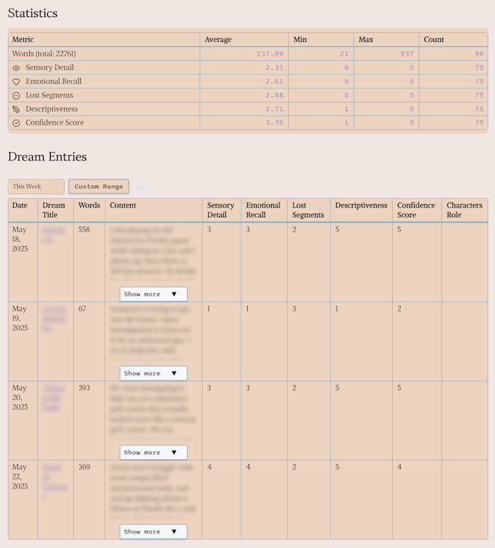

## OneiroMetrics

> **Track, analyze, and visualize your dream journal metrics in Obsidian.**

<p align="center">
  
</p>
<p align="center"><em>"Barn at Sunrise" by Gary Armstrong, inspiration for OneiroMetrics</em></p>

---

### Table of Contents

- [Features](#features)
- [Journal Structure Check](#journal-structure-check)
- [Quick Start](#quick-start)
- [Usage](#usage)
- [Settings](#settings)
- [Debugging & Logging](#debugging--logging)
- [Recent Fixes](#recent-fixes)
- [Documentation](#documentation)
- [Support](#support)
- [License](#license)

---

## Features

- **Comprehensive Metrics Tracking:** Track customizable dream metrics with flexible scoring systems (e.g., sensory detail, emotional recall, lucidity levels)
- **Advanced Date Filtering:** Filter entries by date with intuitive dropdowns, calendar selection, and custom date ranges
- **Favorites System:** Save and quickly access your most-used date ranges and filtering preferences
- **Rich Visualizations:** Summary tables, charts, and statistical analysis of your dream patterns
- **Advanced Chart Types:** Interactive visualizations including box plots, violin plots, correlation matrices, network graphs, and trend decomposition with customizable chart options
- **Enhanced Analytics:** Comprehensive data insights with trend analysis, outlier detection, correlation analysis, and pattern recognition through dedicated Insights tab
- **Data Export:** Export filtered data and analytics insights for further analysis in external tools (CSV format with full statistical metadata)
- **High-Performance Processing:** Efficiently handles large datasets - tested at 564 entries/second with thousands of dream entries
- **Template System:** Create sophisticated dream journal templates with dynamic placeholders like `{{date}}`, `{{date-long}}`, `{{date-month-day}}`, and `{{date-ref}}`
- **Templater Integration:** Full support for [Templater](https://github.com/SilentVoid13/Templater) plugin with fallback compatibility
- **Journal Structure Validation:** Automated checking and validation of dream journal entry formats
- **Accessibility & Mobile:** Complete keyboard navigation support and mobile-optimized responsive design
- **Robust Backup System:** Automatic backups with configurable retention and recovery options
- **Advanced Debugging:** Comprehensive logging system with multiple verbosity levels and performance monitoring
- **Test Suite:** Built-in testing utilities for data generation, performance benchmarking, and system validation

<p align="center">
  
</p>
<p align="center"><em>OneiroMetrics metrics view showing dream journal analysis</em></p>

### Advanced Analytics & Visualizations

> **✅ PHASE 5A & 5B COMPLETED**: Enhanced Analytics and Advanced Chart Types now available

OneiroMetrics now includes powerful analytical capabilities and sophisticated chart visualizations:

#### Enhanced Analytics (Insights Tab)
- **📊 Data Overview:** Total entries, tracked metrics, date ranges, and frequency analysis
- **📈 Trend Analysis:** Linear regression analysis with trend direction detection and recent vs. historical comparisons
- **🎯 Outlier Detection:** Statistical outlier identification using Z-score analysis (>2.5 standard deviations)
- **🔗 Correlation Analysis:** Pearson correlation coefficients with strength classification and correlation matrices
- **🔍 Pattern Recognition:** Entry frequency patterns, cyclical analysis, and metric consistency scoring

#### Advanced Chart Types
- **Compare Tab:** Bar charts, box plots (with quartiles and outliers), and violin plots (density distributions)
- **Trends Tab:** Line charts, area charts, scatter plots with trend lines, and trend decomposition analysis
- **Correlations Tab:** Interactive correlation matrix heatmaps, scatter plot analysis, and network graph visualizations
- **Interactive Controls:** Chart type selectors, smoothing toggles, and correlation threshold sliders
- **Export Integration:** All visualizations support CSV export with complete statistical metadata

#### Analytics Export
All insights and statistical analyses can be exported as structured CSV files including:
- Data overview with sample sizes and confidence levels
- Trend analysis with slopes and direction indicators  
- Outlier detection with Z-scores and dates
- Correlation matrices with significance testing
- Pattern analysis with behavioral insights

### Ribbon Button
- The plugin now uses a single ribbon button to access journal management features. This streamlined interface replaces the previous multiple-button approach for a cleaner user experience.

## Journal Structure Check

> **✅ FEATURE COMPLETED**: Journal Structure functionality has been fully implemented and integrated into OneiroMetrics Hub.

OneiroMetrics includes a comprehensive journal structure validation system to help maintain consistent dream journal entries:

- **✅ Validation**: Check your journal entries against predefined structures
- **✅ Flexibility**: Support for both flat and nested journal structures  
- **✅ Template System**: Create and use templates for consistent journal entries
- **✅ Templater Integration**: Use [Templater](https://github.com/SilentVoid13/Templater) templates for dynamic journal entries (see our [Templater Integration Guide](docs/user/guides/templater.md) for details)
- **✅ Quick Fixes**: Get suggestions for fixing common issues

> **🚀 NEXT PHASE**: Advanced features like auto-detection, content analysis, and migration tools are planned in [Smart Journal Analysis 2025](docs/planning/features/smart-journal-analysis-2025.md).

### Using Journal Structure Check
1. Enable the feature in settings
2. Create or use the default journal structures
3. Create templates with the template wizard
4. Apply templates to new journal entries

### Templater Integration
OneiroMetrics now provides Templater integration as an alternative template engine for dream journals, offering:

- **Dynamic Content:** Automatic dates, user prompts, and conditional content
- **Fallback System:** Templates still work even without Templater installed
- **User-Friendly:** Visual placeholder system for easy template filling
- **Template Wizard:** Create and edit templates with dual preview (Templater and static versions)
- **Backward Compatible:** All existing templates continue to work

For comprehensive details, see our [Templater Integration Guide](docs/user/guides/templater.md).

To use Templater integration:
1. Install the [Templater plugin](https://github.com/SilentVoid13/Templater) (recommended but optional)
2. Create templates using the Template Wizard
3. Insert templates in your dream journal entries

---

## Quick Start

1. **Install:** In Obsidian, go to Settings → Community Plugins → Browse, search for "OneiroMetrics", and install.
2. **Enable:** Turn on the plugin in Community Plugins.
3. **Set Up:** Create a note for your dream journal. Add entries using the callout format:
   ```markdown
   > [!dream-metrics]
   > Words: 343, Sensory Detail: 3, Emotional Recall: 3
   ```
4. **Configure:** Open OneiroMetrics settings to select your metrics note, choose notes/folders to analyze, and adjust preferences.

---

## Usage

- **Reading View Required:** OneiroMetrics works best in Reading View. If you open a metrics note in Live Preview, you'll see a warning.
- **Access Settings:**  
  - In the Hub modal, click the 'Settings' button.

- **Filtering:** Choose from multiple date filtering options in the dropdown: "All Time", "Today", "Yesterday", "This Week", "This Month", "Last 30 Days", "Last 6 Months", "This Year", and "Last 12 Months". Use the "Date Navigator" button for custom date selection and date range filtering. Save frequently used date ranges as favorites for quick access. All filter selections are automatically saved and restored between sessions.

- **Metrics Table:** View, sort, and analyze your dream data in a responsive table. Use the Readable Line Length toggle for optimal display.

- **Backups:** Enable automatic backups in settings to protect your data.

---

## Settings

- **OneiroMetrics Note:** Where your summary table is stored.
- **Selected Notes/Folders:** Choose which notes to analyze.
- **Metrics:** Add, edit, or remove metrics. Customize names, icons, ranges, and descriptions.
- **Display:** Toggle readable line length, configure week start day, and view metric descriptions.
- **Backups:** Enable/disable, set backup folder, and manage backup files.
- **Logging:** Set log level (Off, Errors, Warn, Info, Debug, Trace).  
  - Logging is **Off** by default. Enable only for troubleshooting.

---

## Recent Fixes

- "Show more" button now reliably expands/collapses dream content.
- Scroll jump issues resolved for stable table view.
- Table performance improved for large datasets.
- Date filter dropdown and status display now work as intended.
- **Settings button** in both the Dream Scraper modal and metrics note now always opens the correct OneiroMetrics settings tab.

See [ISSUES.md](ISSUES.md#fixed-issues) for more.

---

## Documentation

The documentation has been completely reorganized into a user-friendly, structured hierarchy. Visit the [Documentation Index](docs/README.md) for a comprehensive guide to all available resources.

- [Project Overview](docs/developer/architecture/overview.md)
- [Usage Guide](docs/user/guides/usage.md)
- [Logging Guide](docs/developer/implementation/logging.md)
- [Known Issues](ISSUES.md)
- [Release Notes](CHANGELOG.md)
- [Metrics Guide](docs/user/reference/metrics.md)
- [Testing Guide](docs/developer/testing/testing-overview.md)
- [Date Tools Plan](docs/planning/features/date-tools.md)
- [Defensive Coding Implementation](docs/planning/tasks/defensive-coding-implementation.md)
- [API Integration Hardening Plan](docs/planning/tasks/api-integration-hardening-plan.md)

---

## Support

- Check [GitHub Issues](https://github.com/your-repo/issues)
- Open a new issue with details and steps to reproduce

---

## License

MIT License – see [LICENSE.md](LICENSE.md)

---

**For advanced details, see the [docs/](docs/) folder.** 
