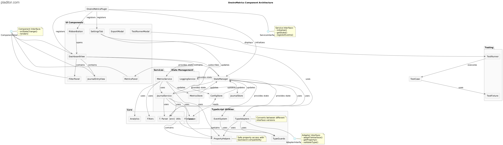

# OneiroMetrics Architecture Overview

This document provides a high-level overview of the OneiroMetrics plugin architecture after the 2025 refactoring project.

## Core Architecture Principles

The refactored architecture follows these key principles:

1. **Modular Design**: Functionality is divided into cohesive, loosely coupled modules
2. **Interface-First Development**: Components interact through well-defined interfaces
3. **Separation of Concerns**: Clear boundaries between UI, business logic, and data access
4. **Observable State**: State changes propagate through a centralized state management system
5. **Testability**: Components designed to be easily testable in isolation

## Component Architecture

The OneiroMetrics plugin is organized into the following major component groups:



### Core Plugin Component

- **OneiroMetricsPlugin**: The entry point that initializes the plugin and registers with Obsidian

### State Management

- **StateManager**: Centralized state management that maintains application state
- **JournalStore**: Manages journal entry data
- **MetricsStore**: Manages calculated metrics
- **ConfigStore**: Manages user configuration

### Services

- **FileService**: Handles file system operations
- **JournalService**: Processes journal entries
- **MetricsService**: Calculates metrics from journal data
- **TemplateService**: Manages journal templates
- **LoggingService**: Handles error and event logging

### UI Components

- **RibbonButton**: Adds plugin button to Obsidian ribbon
- **SettingsTab**: Plugin settings interface
- **DashboardView**: Main interface for viewing journals and metrics
- **JournalEntryView**: Displays individual journal entries
- **MetricsPanel**: Displays calculated metrics
- **FilterPanel**: Provides filtering controls
- **ExportModal**: Handles data export
- **TestRunnerModal**: Interface for running tests

### Core Modules

- **Parser**: Parses journal content into structured data
- **Filters**: Applies filters to journal and metrics data
- **Analytics**: Performs metric calculations
- **Utils**: Utility functions used throughout the plugin

## Data Flow

The data flow within OneiroMetrics follows a predictable pattern:


1. User interacts with the UI
2. UI components dispatch actions to services
3. Services process the data and update the state
4. State changes trigger UI updates
5. File operations persist changes to the Obsidian vault

## State Lifecycle

The state management system follows this lifecycle:


1. Plugin initialization loads configuration
2. Services initialize based on configuration
3. Journal data is loaded and processed
4. Metrics are calculated from journal data
5. UI is rendered based on current state
6. User interactions trigger state updates
7. State updates flow through the system

## Testing Infrastructure

The plugin includes a comprehensive testing infrastructure:


- **TestRunner**: Executes test cases
- **TestCase**: Abstract base class for all tests
- **TestFixture**: Provides test environment and mock data
- **TestRegistry**: Registers and organizes tests
- **TestRunnerModal**: UI for running tests and viewing results

See the [Test Data Flow](./diagrams/Oom-Testing-Execution-Flow.png) diagram for more details on how tests are executed.

## Key Interfaces

The architecture defines several key interfaces that enable loose coupling:

- **IStateManager**: Interface for state management operations
- **IStore**: Common interface for all data stores
- **IService**: Base interface for all services
- **IParser**: Interface for journal parsing
- **IComponent**: Interface for UI components

## Performance Considerations

The architecture addresses performance through:

1. **Lazy Loading**: Components and data loaded only when needed
2. **Efficient State Updates**: Only affected components re-render
3. **Caching**: Frequently used data cached for performance
4. **Background Processing**: Heavy processing runs in the background
5. **Incremental Updates**: Only process changed data when possible

## Security and Error Handling

The architecture implements:

1. **Centralized Error Handling**: All errors flow through LoggingService
2. **Error Recovery**: Components can recover from common errors
3. **Safe File Operations**: File operations use transactions where possible
4. **Data Validation**: Input validation at service boundaries
5. **Secure Data Storage**: Sensitive settings stored securely

## Next Steps

See the [Post-Refactoring Roadmap](../implementation/post-refactoring-roadmap.md) for planned improvements building on this architecture.

# OneiroMetrics Plugin Overview

## Project Description
OneiroMetrics is an Obsidian plugin designed to help users track and analyze their dreams. It provides tools for recording dream entries, analyzing dream patterns, and generating insights through various metrics and visualizations.

> **Note:** For detailed performance testing and optimization guidelines, see [Performance Testing](../testing/performance-testing.md).

## Core Features
1. **Dream Entry Management**
   - Record and organize dream entries
   - Tag and categorize dreams
   - Search and filter dream content

2. **Metrics and Analysis**
   - Track dream patterns and themes
   - Generate insights from dream content
   - Visualize dream data through tables and charts

3. **Project Note Integration**
   - Display dream entries in a structured table
   - Show metrics summary
   - Provide interactive content expansion
   - **Date Tools:** Comprehensive suite for analyzing dream entries across time periods, including custom date filtering, multi-month calendar views, date range comparison, and pattern analysis.

4. **Templater Integration**
   - Standardized templates using Templater for dynamic content
   - Automatic static fallback for users without Templater installed
   - Interactive template creation with placeholders
   - Template wizard with dual preview (dynamic and static versions)
   - Smart placeholder navigation for template filling

5. **Settings and Customization**
   - Configure custom metrics
   - Customize display options
   - Manage dream entry sources

## Technical Architecture

### Frontend Components
1. **Modal System**
   - Base modal structure
   - Various modal variants (custom date, metrics, callout, etc.)
   - Accessibility features
   - Responsive design

2. **Table Components**
   - Dream entries table
   - Metrics summary table
   - Dream content display
   - Interactive buttons and controls

3. **Settings Interface**
   - Metric configuration
   - Icon selection
   - Drag and drop reordering
   - Custom date selection

### CSS Architecture
- Modular component-based structure
- BEM-like naming conventions
- CSS custom properties for theming
- Mobile-first responsive design
- Accessibility considerations

### File Organization
```
styles/
├── base/                  # Base styles and variables
│   ├── variables.css     # CSS custom properties
│   ├── reset.css         # CSS reset/normalization
│   └── typography.css    # Typography styles
├── components/           # Component-specific styles
│   ├── modals.css                # Modal system styles
│   ├── settings-metrics-drag-drop.css    # Metric reordering
│   ├── settings-metrics-icon-picker.css  # Icon picker
│   ├── tables-dream-content.css          # Dream content
│   ├── tables-dream-entries.css          # Dream entries
│   ├── tables-dream-entries-buttons.css  # Table buttons
│   └── tables-metrics-summary.css        # Metrics summary
└── styles.css            # Main stylesheet
```

## Development Status
- [x] Core functionality implemented
- [x] CSS refactoring completed
- [x] Component organization improved
- [ ] Performance optimization
- [ ] Accessibility audit
- [ ] Documentation updates

## Future Enhancements
1. **Performance Optimization**
   - Optimize CSS selectors
   - Reduce specificity conflicts
   - Improve animation performance

2. **Accessibility Improvements**
   - Enhance keyboard navigation
   - Improve screen reader support
   - Add ARIA attributes

3. **Documentation**
   - Complete component documentation
   - Add usage examples
   - Document best practices

## Contributing
Please refer to `CONTRIBUTING.md` for guidelines on how to contribute to the project.

## License
This project is licensed under the MIT License - see the `LICENSE` file for details.

## Recent Updates
- **Templater Integration:**
  - Standardized templates with Templater as the recommended engine
  - Automatic fallback mechanism for users without Templater
  - Template wizard with dual preview (Templater and static versions)
  - Placeholder system for easy template filling
  - Backward compatibility with existing templates
  - Improved template UI with clearer guidance

- **Enhanced Filtering System:**
  - Date range filter with calendar preview
  - Custom Date Filter with date range selection
  - Quick filter buttons for common ranges
  - Visual feedback for active filters
  - Filter state persistence
  - Responsive filter layout
  - Theme-aware styling
  - The date filter dropdown is now fully functional, with improved usability, clear labels, and color-coded icons for each filter state.

- **UI Improvements:**
  - Filter container with consistent styling
  - Quick filter buttons with icons
  - Clear visual hierarchy
  - Improved button states
  - Better mobile responsiveness
  - Enhanced accessibility features

- **New Optional Metrics Added:**
  - Dream Theme (Categorical/Keywords)
  - Lucidity Level (Score 1-5)
  - Dream Coherence (Score 1-5)
  - Setting Familiarity (Score 1-5)
  - Ease of Recall (Score 1-5)
  - Recall Stability (Score 1-5)

- **Metric Order Updated:**
  - **Default Metrics:** Sensory Detail, Emotional Recall, Descriptiveness, Characters Role, Confidence Score
  - **Optional Metrics:** Characters Count, Familiar Count, Unfamiliar Count, Characters List, Dream Theme, Lucidity Level, Dream Coherence, Setting Familiarity, Ease of Recall, Recall Stability

- **UI Enhancements:**
  - Optional metrics are now displayed in a collapsible section, improving usability and reducing visual clutter.
  - **Metrics Descriptions Modal:** A dedicated modal now displays all metric descriptions (default and optional) with a landscape layout, improved table borders, and Lucide icons integrated into headings. This modal is accessible via a 'Metrics Descriptions' button in the settings page.
  - **Settings Page Overhaul:** The Settings page now features a visually distinct bordered metrics section, clear section dividers, and helper text under key section headers for improved clarity and usability. Default and Optional Metrics are grouped and styled for easier navigation.

## Current Status
- The filtering system and metrics scraping are functioning as expected.
- The 'Read more' button arrow changes on click, but the content does not expand; this is under active investigation.
- UI rendering and event handling for expand/collapse are being debugged.
- Ongoing testing is focused on interactive elements and accessibility.
- Next steps: Continue debugging the expand/collapse feature and review event delegation and DOM updates.

## Next Steps
- **Testing:** 
  - Verify Custom Date Filter UI accessibility features
  - Test calendar preview responsiveness
  - Validate keyboard navigation
  - Check high contrast mode compatibility
- **Documentation:** Review and update documentation to reflect recent changes
- **Feedback:** Gather user feedback on the new Custom Date Filter UI and metrics

## Recent Improvements and Lessons Learned

### Event Handling Improvements
- Replaced non-existent `file-change` event with correct `modify` event from vault
- Added proper event subscriptions for workspace changes
- Enhanced logging for better debugging
- Improved filter state management

### Date Handling Enhancements
- Implemented robust date parsing for multiple formats
- Added detailed logging for date parsing attempts
- Improved error handling for invalid dates
- Enhanced date format detection

### UI/UX Refinements
- Simplified expand/collapse functionality
- Added ARIA attributes for better accessibility
- Improved button state management
- Enhanced content visibility toggling

### Development Best Practices
- Keep event handling simple and use correct Obsidian events
- Maintain consistent logging for debugging
- Focus on core functionality before adding complexity
- Test each change thoroughly before moving on
- Document changes and fixes promptly

## Key Features

- **Metrics Extraction:** Automatically scrapes dream metrics from selected notes using configurable callouts.
- **Detailed Metrics Table:** Displays a sortable, filterable table of dream entries, including:
  - Date, title (with clickable links), word count, and all configured metrics.
  - Dream content column with expandable/collapsible preview and full text (preserving paragraph breaks).
  - Optimized column widths and alignment for better readability.
  - Center-aligned numeric metrics for easy scanning.
  - Full-width table layout that overrides readable line length.
- **Summary Table:** Shows averages, min/max, and counts for each metric.
- **Multi-Note Selection:** Select multiple notes to include in metrics scraping, using a multi-chip autocomplete field.
- **Settings Modal:** Configure project note path, callout name, and selected notes with a modern, user-friendly UI.
- **Theme & Mobile Friendly:** 
  - All UI elements are styled to match Obsidian's theme and are responsive.
  - Tables adapt to screen size while maintaining readability.
  - Full-width sections for optimal space utilization.
- **Safe Updates:** Project note is backed up before overwriting metrics tables.
- **Testing & Troubleshooting:** Comprehensive testing checklist and troubleshooting guide included.

## Recent Fixes

- The "Show more" button for dream content now reliably expands and collapses content in the Dream Entries table across all tested themes and with/without custom CSS snippets.
- All debug and backup log files are now stored in the `logs/` folder and excluded from version control.
- The debug button ("Debug: Attach Show More Listeners") is now visible at the top of the project note when logging is set to **Debug** in settings. This allows users to manually reattach event listeners for expand/collapse buttons if needed.
- Both Settings buttons (in the Dream Scrape modal and at the top of the metrics note) now reliably open the OneiroMetrics settings tab.
- To access the debug button for troubleshooting, set Logging Level to **Debug** in OneiroMetrics settings.
- The root-level LOGGING.md has been removed; all logging documentation is now in `../implementation/logging.md`.

## Current Status (as of May 2025)

- ✅ **Lucide icons:** Now render correctly in all tables and modals.
- ✅ **Show more button:** Expands/collapses dream content as expected.
- ✅ **Table sorting:** Clicking column headers sorts the Dream Entries table.
- ✅ **Filtering:** Date and metric filtering now updates the Dream Entries table.
- ✅ **Autocomplete, backup, and modal UI:** All previously reported issues are resolved.
- ✅ **Logging system:** Implemented with configurable levels and performance tracking.
- ✅ **State persistence:** Expanded/collapsed states now persist across sessions.
- ✅ **Performance:** Optimized with debounced updates and efficient DOM operations.
- ✅ **Accessibility:** Enhanced with ARIA attributes and keyboard navigation.
- ⏳ **Performance optimizations:** Additional optimizations pending for large datasets.
- ⏳ **Advanced features:** See Planned Features below.

## Known Issues & Testing

- [x] Lucide icons now render in all tables and modals.
- [x] Show more button expands/collapses content.
- [x] Table sorting works for all columns except Content.
- [x] Filtering updates table correctly.
- [x] State persistence works across sessions.
- [x] Logging system provides comprehensive debugging.
- [ ] Performance with large datasets needs further optimization.
- [x] Filtering by date and metric works as expected.
- [x] All previously reported UI/UX issues are resolved.
- [ ] Performance optimizations pending implementation and testing.
- [ ] Advanced features and enhancements in progress (see Planned Features).

## Documentation & Testing

- 📄 **Testing & Troubleshooting Guide:**  
  See [`TESTING.md`](../../../TESTING.md) in the project root for a full checklist, performance tests, and troubleshooting steps.

For information about the plugin's logging system and debugging capabilities, see [Logging System](../implementation/logging.md).

## How to Use

1. **Install the plugin** in Obsidian.
2. **Open the OneiroMetrics modal** from the ribbon or command palette.
3. **Configure your settings:**  
   - Set the Project Note Path (where metrics tables will be written).
   - Select notes to include using the multi-chip autocomplete.
   - Set your callout name if different from the default.
4. **Scrape metrics** and review the generated tables in your project note.
5. **Expand/collapse dream content** in the detailed table for full context.
6. **Use filters and sorting** to analyze your dream metrics:
   - Sort any column by clicking its header
   - Filter by date range or specific metrics
   - Expand dream content entries for more detail
   - **Toggle Readable Line Length** directly below the Dream Entries heading for instant table width control (also available in settings).

## Contributing & Feedback

- Please use the checklist in `TESTING.md` when testing new features or reporting bugs.
- For issues, include console logs, screenshots, and details as described in the bug reporting template in `TESTING.md`.
- When suggesting UI improvements, please consider both desktop and mobile usability.

## Testing Strategy
- [ ] Automated unit testing for core functions
- [ ] Manual integration testing for Obsidian API
- [ ] End-to-end testing for user workflows
- [ ] Performance testing for large datasets
- [ ] Cross-platform compatibility testing
- [ ] Theme compatibility testing

## Development Guidelines
- [ ] Follow TypeScript best practices
- [ ] Maintain comprehensive test coverage
- [ ] Document all new features
- [ ] Update testing documentation
- [ ] Regular performance optimization
- [ ] Consistent error handling
- [ ] User feedback integration

## Documentation
For detailed information about the metrics used in OneiroMetrics, including scoring guidelines and examples, see [METRICS.md](../../../METRICS.md).

For information about the plugin's logging system and debugging capabilities, see [Logging System](../implementation/logging.md).

- 🛠️ **Lucide icons now render correctly as SVGs in the Settings > Metrics section, providing clear visual indicators for each metric.**
- 🛠️ **Metric range labels for 'Lost Segments' and 'Familiar People' now display 'Any whole number' instead of a fixed range.**
- 🛠️ **File/folder suggestion and autocomplete logic in settings has been reviewed and is being improved for reliability and usability.**
- 🛠️ **Metric editor modal now supports 'Any whole number' for Lost Segments and Familiar People, hiding min/max fields and updating the preview accordingly.**
- 🛠️ **Fix for file/folder suggestions in settings is in progress.**
- 🛠️ **File/folder suggestion dropdowns in settings now explicitly set display:block/display:none, ensuring suggestions are visible as you type in Backup Folder and Selected Notes fields.**
- 🛠️ **Parser blockStack logic has been fixed:** The plugin now correctly nests dream-diary and dream-metrics callouts under their parent journal-entry and dream-diary blocks, enabling robust extraction of dream entries from nested callouts.
- 🛠️ **Granular debug logging:** Extensive debug logs and iterative troubleshooting were used to diagnose and resolve extraction issues, ensuring reliability for real-world dream journal structures.

## Recent Updates (May 2025)

- **Chips Area UI:** The chips area for selected notes is now visually flat, with no border, background, or box-shadow.
- **Backup File Extension:** Backup files now use the .bak extension instead of .md.
- **Open Metrics Note Button:** The modal now includes an Open Metrics Note button, only enabled when the note exists, which opens the note in Obsidian.

## Debug Logging & Troubleshooting Note Updates

To ensure reliability in metrics extraction and note updating, the plugin now includes granular debug logging at key steps:

- When scraping, logs show the number of dream entries found, the project note path, and the full array of extracted entries.
- Before updating the OneiroMetrics Note, logs and Notices indicate whether the update function is called, the number of entries, and the content being written.
- If no entries are found or the note path does not match, debug Notices and logs are shown.

**Troubleshooting Steps:**
1. Check for debug Notices in Obsidian (e.g., `[DEBUG] updateProjectNote called for: ...`).
2. Confirm the "OneiroMetrics Note Path" in settings matches the file you are viewing.
3. Open the note in the editor and look for the `<!-- OOM METRICS START -->` marker in the raw Markdown.
4. If no entries are found, check the console for logs about dream entry extraction.
5. If issues persist, enable even more granular debug logs in the extraction loop to print each entry (date, title, metrics).

This approach helps pinpoint where the update process may be breaking down and ensures the correct file is being updated with the latest metrics.

## Logging and Debug Output Policy

- To improve performance and maintainability, we plan to reduce excessive logging and remove or limit debug console.logs, especially those related to backup creation and extraction logic.
- Future code changes should ensure only essential logs remain, and debug output should be temporary and well-scoped.

## Documentation Requirements
- [Date and Time Technical Specification](../implementation/date-time.md) for date handling implementation
- [Layout and Styling Technical Specification](../../archive/LAYOUT_AND_STYLING.md) for UI/UX implementation
- [Testing Guide](../testing/testing-overview.md) for testing procedures
- [Project Overview](./overview.md) for high-level architecture
- [Issues and Future Improvements](../../../ISSUES.md) for known issues and planned features
- [Logging System](../implementation/logging.md) for debugging and monitoring capabilities
- [State Persistence](../implementation/state.md) for user preference management

## Future Features and Planning
- See [Date Tools Plan](../../planning/features/date-tools.md) for the current plan and open questions regarding the custom date range picker feature.

## Filters Expansion Progress

### Phase 1 (Complete)
- Custom Date Range modal for selecting start/end dates
- Favorites system: save, select, and delete custom date ranges
- UI/UX improvements: visual hierarchy, compact favorites list, Lucide icons, improved modal layout, and button prominence
- Accessibility and keyboard navigation improvements
- Responsive modal width and layout

### Phase 2 (Planned)
- User-defined custom presets in the dropdown
- Calendar improvements (multi-month view, week numbers, preview optimization)
- Further UI/UX polish (favorites editing, tooltips, empty state, etc.)
- Additional accessibility enhancements
- Advanced filtering and analytics features

## Feature Documentation

The following features are documented in detail in separate files:

- **Core Plugin**: The main plugin functionality is documented in the source code and `main.ts`.
- **Settings**: Settings are documented in `settings.ts` and the sources code.
- **Metrics**: The metrics system is documented in [Metrics Reference](../../user/reference/metrics.md) and [Metrics Enhancements Plan](../../planning/features/metrics-enhancements.md).
- **Journal Structure Check**: The journal structure validation system (formerly known as "Linting") is documented in [Journal Structure Guidelines](../../user/guides/journal-structure.md) (for users) and [Code Standards](../contributing/code-standards.md) (for developers). Implementation details can be found in [Journal Structure Check Implementation Plan](../../planning/features/journal-structure-check.md).
- **Templates**: Template functionality including the new Templater integration is documented in `docs/planning/features/templater-integration.md`.
- **CSS**: The CSS architecture is documented in `docs/CSS_REFACTORING.md`. All plugin-specific CSS classes now use the "oom-" prefix to avoid conflicts.
- **Testing**: Testing procedures are documented in `docs/TESTING.md`.
- **Development**: Development workflows are documented in `docs/CONTRIBUTING.md`.

## TypeScript Architecture

The OneiroMetrics plugin is implemented in TypeScript, following a structured approach to ensure type safety, interface consistency, and robust error handling. The TypeScript architecture provides several key benefits:

1. **Type Safety**: Strong typing across component boundaries
2. **Interface Consistency**: Well-defined interfaces for all components
3. **Error Prevention**: Compile-time error detection
4. **Code Maintainability**: Better intellisense and documentation
5. **Refactoring Support**: Type-aware refactoring tools

### Type System Organization

The plugin organizes types into several key categories:


- **Core Types**: Located in `src/types/core`, these are the fundamental interfaces used throughout the application
- **Domain-Specific Types**: Specialized types for specific areas (metrics, journals, UI)
- **Helper Types**: Utility types for common patterns and transformations
- **Adapter Types**: Types that bridge between different interface versions

For detailed information on the type system, see the [TypeScript Adapter Pattern Guide](../implementation/typescript-adapter-patterns.md).

### Adapter Pattern Implementation

To handle interface evolution and backward compatibility, the plugin implements the adapter pattern:


- **Type Adapters**: Convert between different interface versions
- **Property Access Helpers**: Safely access properties across interface versions
- **Type Guards**: Validate object shapes at runtime

This pattern allows the codebase to evolve while maintaining compatibility with existing data structures and third-party code. For implementation details, see the [TypeScript Adapter Pattern Guide](../implementation/typescript-adapter-patterns.md).

### Helper Utilities

The plugin uses several helper utility libraries to ensure type safety and consistent behavior:

- **settings-helpers.ts**: Safe access to configuration settings with backward compatibility
- **metric-helpers.ts**: Type-safe handling of metric objects and their properties
- **selection-mode-helpers.ts**: Compatibility layer for selection mode values

These utilities provide a robust interface between application code and data structures. For usage patterns and examples, see the [TypeScript Helper Utilities Guide](../implementation/typescript-helper-utilities.md).

### Event Communication System

Components communicate through a type-safe event system:


- **EventEmitter**: Base class for all event communication
- **Typed Events**: Events with typed payloads
- **Event Subscriptions**: Type-safe event subscription management

This system ensures that events carry properly typed data between components, making the communication robust and self-documenting.

### Best Practices and Standards

The plugin follows a comprehensive set of TypeScript best practices to ensure code quality and maintainability:

- **Type Safety**: Explicit typing and avoidance of `any` type
- **Interface Design**: Evolution-friendly interface design with proper inheritance
- **Property Access**: Safe property access patterns with null handling
- **Error Handling**: Context-enriched error handling with appropriate recovery
- **Component Development**: Consistent component patterns with proper lifecycle management

For a complete guide to TypeScript best practices in the OneiroMetrics codebase, see the [TypeScript Best Practices Guide](../implementation/typescript-best-practices.md).

### Logging System

The plugin implements a comprehensive logging system:


- **LogManager**: Central coordination point for all logging
- **Logger Implementations**: Console, file, and debug loggers
- **Log Levels**: Configurable verbosity levels
- **Formatters**: Consistent log message formatting

For more information about the logging implementation, see [Logging Documentation](../implementation/logging.md). 