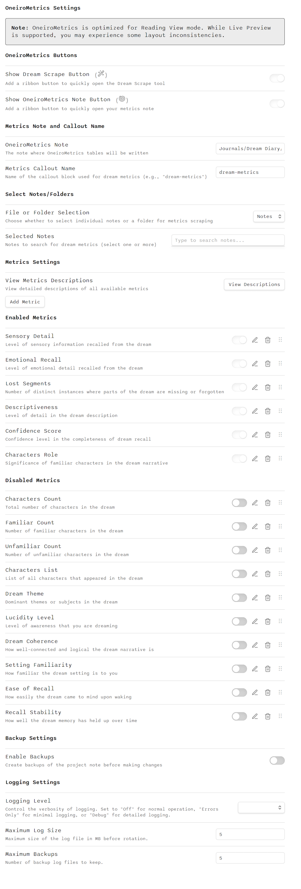

# OneiroMetrics Plugin Specification

## Table of Contents

1. [Overview](#overview)
2. [Core Components](#core-components)
3. [Features](#features)
4. [Technical Architecture](#technical-architecture)
5. [Templater Integration](#templater-integration)
6. [Technical Requirements](#technical-requirements)
7. [Security Considerations](#security-considerations)
8. [CSS Organization and Approach](#css-organization-and-approach)
9. [Expand/Collapse ("Read more") Functionality](#expandcollapse-read-more-functionality)
10. [Performance Considerations](#performance-considerations)
11. [Future Considerations](#future-considerations)
12. [Testing Strategy](#testing-strategy)
13. [Recent Fixes](#recent-fixes)
14. [Scraping Modal ("OneiroMetrics Dream Scrape")](#scraping-modal-oneirometrics-dream-scrape)

## Overview

OneiroMetrics is an Obsidian plugin designed to analyze dream journal entries and provide detailed metrics and insights. This document outlines the technical specifications, requirements, and implementation details.

## Core Components

### 1. View Mode Requirements
OneiroMetrics is designed to work exclusively with Reading View mode in Obsidian. For detailed information about view mode requirements, limitations, and future enhancements, please refer to the [View Mode Requirements](../../user/guides/view-mode.md) document.

### 2. Plugin Structure

```
dream-metrics/
├── main.ts              # Main plugin logic
├── settings.ts          # Settings management
├── types.ts            # TypeScript interfaces
├── styles.css          # Custom styling
├── manifest.json       # Plugin metadata
├── package.json        # NPM configuration
├── esbuild.config.mjs  # Build configuration
└── docs/              # Documentation
```

### 3. Data Structures

#### DreamMetric Interface
```typescript
interface DreamMetric {
    name: string;
    icon: string;        // Lucide icon identifier
    range: {
        min: number;
        max: number;
    };
    description: string;
}
```

#### DreamMetricsSettings Interface
```typescript
interface DreamMetricsSettings {
    projectNotePath: string;
    metrics: DreamMetric[];
    selectedNotes: string[];
    calloutName: string;
    weekStartDay: number;  // 0-6, where 0 is Sunday
    overrideReadableLineLength: boolean;
}
```

#### DreamMetricData Interface
```typescript
interface DreamMetricData {
    date: string;
    title: string;
    content: string;
    wordCount: number;
    metrics: {
        [key: string]: number;
    };
}
```

### 4. Callout Format

Dream metrics are stored in Obsidian callout blocks with the following format:

```markdown
> [!dream-metrics]
> Metric1: value1, Metric2: value2, ...
```

Example:
```markdown
> [!dream-metrics]
> Words: 343, Sensory Detail: 3, Emotional Recall: 3, Lost Segments: 3, Descriptiveness: 4, Confidence Score: 4
```

### 5. Project Note Format

The project note is generated with two main sections:

#### Summary Section
```markdown
# Dream Metrics Summary

| Metric | Average | Min | Max | Count |
|--------|---------|-----|-----|-------|
| Metric1 | 3.5 | 1 | 5 | 10 |
| Metric2 | 4.2 | 2 | 5 | 10 |
```

#### Detailed Section
```markdown
# Dream Entries

| Date | Title | Words | Content | Metric1 | Metric2 | ... |
|------|-------|-------|---------|---------|---------|-----|
| 2025-05-08 | Dream Title | 343 | [Preview] | 4 | 3 | ... |
```

## Features

### 1. Settings Management
- Project note path configuration with smart file suggestions
- Multi-chip autocomplete for note selection
- Custom metric definitions with validation
- Callout name customization
- Real-time validation feedback
- Metric icon picker with Lucide icons
- Week start day configuration
- Readable line length override toggle
- Quick access to settings via:
  - Command palette (Ctrl/Cmd + P, then type "OneiroMetrics Settings")
  - Settings button in the Dream Scrape modal
  - Settings button in the OneiroMetrics note
  - Right-click on the ribbon icon

### 2. Metric Scraping
- Regex-based callout detection
- Key-value pair parsing
- Date and title extraction
- Metric validation
- Content cleaning for markdown elements
- Automatic backup system with .bak extension

### 3. Data Presentation
- Responsive table layout
- Full-width sections (overrides readable line length)
- Optimized column widths:
  - Date: 8%
  - Title: 15%
  - Words: 7%
  - Content: 30%
  - Metrics: 8% each
- Expandable/collapsible content preview
- Center-aligned numeric metrics
- Sortable columns
- Date range and metric filtering
- 'This Week' filter with configurable start day

### 4. File Suggestion System
- Smart path matching for:
  - Spaces, dashes, underscores
  - Case-insensitive matching
  - Year-based paths (e.g., "2025" → "Journals/2025/2025.md")
- Multi-chip autocomplete for note selection
- Real-time validation and feedback

### 5. Accessibility Features
- Full keyboard navigation support
- Screen reader compatibility
- ARIA labels and roles
- Focus management
- Keyboard shortcuts for common actions

### 6. Table Virtualization for Performance

- The Dream Entries table uses vanilla JavaScript virtualization to efficiently handle large datasets.
- Only **12 rows** are rendered in the DOM at any given time (reduced from 25 for better performance and responsiveness); as the user scrolls, the visible window of rows is updated.
- Spacer rows are used above and below the visible rows to maintain correct scroll height and scrollbar behavior.
- A debounced scroll event handler recalculates and renders the visible rows as needed.
- **Scroll logic ensures that expanding/collapsing a row keeps the view stable and prevents jumping beneath the table.**
- This approach significantly reduces DOM size and memory usage, improving responsiveness and scalability for large dream journals.

### Settings UI and Metric Management

The Settings page provides a comprehensive interface for managing dream metrics and plugin configuration. The following features are available:

- **Metrics Grouping:**
  - Metrics are displayed in two sections: **Enabled Metrics** and **Disabled Metrics**.
  - Each section only appears if it contains metrics.
  - Toggling a metric's enabled state will move it between sections in real time.

- **Metric Editing:**
  - Each metric row includes:
    - A toggle to enable/disable the metric.
    - An **Edit** button (pencil icon) that opens a modal for editing all properties of the metric (name, icon, range, description, enabled state, etc.).
    - A **Delete** button (trash icon) to remove the metric.
  - The **Edit Metric** modal provides:
    - Real-time validation for all fields (name, range, description).
    - A Lucide icon picker with search and category tabs.
    - Range editing (with special handling for whole-number metrics).
    - Live preview of how the metric will appear in the journal.
    - Keyboard shortcuts for accessibility.

- **Adding Metrics:**
  - An **Add Metric** button opens the same modal in creation mode.
  - New metrics are added to the appropriate group based on their enabled state.

- **Other Features:**
  - Drag handles are present for future reordering support (if not yet implemented).
  - All changes are saved immediately and reflected in the UI.
  - The UI is designed to match Obsidian's settings conventions for clarity and accessibility.

**Note:** The Settings UI is kept in sync with the plugin's internal state and the default metrics specification. Any changes to the default metrics or user customizations are immediately reflected in the interface.

## Technical Architecture

### Core Components
1. **Data Management**
   - Dream entry parsing
   - Metric extraction
   - Data storage and retrieval
   - State management
   - See [State Persistence](../implementation/state.md) for user preference management

2. **Date Handling Strategy**
   - See [Date and Time Technical Specification](../implementation/date-time.md) for detailed implementation
   - Block references as primary date source
   - Fallback date formats
   - Date filtering system
   - Multi-month calendar
   - Date comparison tools
   - Pattern analysis

## TypeScript Architecture

### Type System Organization

The OneiroMetrics plugin uses a structured TypeScript type system organized into several key areas:

1. **Core Interfaces** (`src/types/core.ts`)
   - Contains foundational interface definitions
   - Serves as the source of truth for type definitions
   - Includes comprehensive JSDoc documentation

2. **Root-Level Types** (`types.ts`)
   - Extends core interfaces for backward compatibility
   - Acts as a bridge between the core types and legacy code

3. **Domain-Specific Types**
   - Specialized types for specific domains (e.g., `src/types/callout-types.ts`, `src/types/logging.ts`)
   - Extends core types with domain-specific properties

4. **Utility Types**
   - Type transformations for specific use cases
   - Generic type utilities for reusability
   - Type guards for runtime validation

5. **Interface Evolution**
   - Versioned interfaces for backward compatibility
   - Extension patterns for interface evolution
   - Property inheritance through interface composition

### Adapter Pattern Implementation

To ensure compatibility between different interface versions and handle property changes, the plugin implements the adapter pattern:

1. **Type Adapters** (`src/utils/type-adapters.ts`)
   - Provides utility functions to convert between different interface versions
   - Ensures backward compatibility with older plugin versions
   - Handles default values and property mapping
   - Creates standardized objects from various input formats

```typescript
// Example of a strong adapter function
export function adaptToCoreDreamMetricsSettings(settings: any): CoreDreamMetricsSettings {
  return {
    projectNote: getProjectNotePath(settings),
    selectedNotes: getSelectedNotes(settings) || [],
    selectedFolder: getSelectedFolder(settings) || '',
    selectionMode: getCompatibleSelectionMode(settings),
    calloutName: getCalloutName(settings) || 'dream',
    metrics: adaptMetrics(settings),
    // Additional properties with defaults
    showRibbonButtons: getShowRibbonButtons(settings),
    backupEnabled: isBackupEnabled(settings),
    backupFolderPath: getBackupFolderPath(settings) || './backups',
    logging: adaptLoggingConfig(settings)
  };
}
```

2. **Helper Utilities**
   - `settings-helpers.ts`: Safe property access for settings objects
   - `metric-helpers.ts`: Type-safe metric property access
   - `selection-mode-helpers.ts`: Compatibility for selection mode values
   - `journal-helpers.ts`: Safe access to journal entry properties

```typescript
// Example of a safe property access helper
export function getProjectNotePath(settings: any): string {
  return settings?.projectNote || 
         settings?.projectNotePath || 
         '';
}

// Example of a type-safe metric helper
export function isMetricEnabled(metric: any): boolean {
  if (!metric) return false;
  if (metric.enabled !== undefined) return !!metric.enabled;
  return !metric.disabled; // Legacy compatibility
}
```

3. **Adapter Functions**
   - Pure functions that don't modify input objects
   - Return new objects with standardized properties
   - Handle various input formats consistently
   - Provide sensible defaults for missing properties

4. **Migration Strategy**
   - Graduated approach to interface standardization
   - Legacy code support through adapters
   - Clear documentation of migration paths
   - Type guard checks for runtime safety

### Safe Property Access Pattern

To handle potentially undefined properties and different property names across interface versions, the plugin uses a safe property access pattern:

1. **Type Guards**
   - Functions that check types before property access
   - Ensures runtime safety for property access
   - Provides type narrowing for the TypeScript compiler
   - Enables more precise type checking in subsequent code

```typescript
// Example type guard for source property
export function isObjectSource(entry: DreamMetricData): entry is DreamMetricData & { source: { file: string } } {
  return typeof entry.source !== 'string' && !!entry.source;
}

export function getSourceFile(entry: DreamMetricData): string {
  if (isObjectSource(entry)) {
    return entry.source.file;
  }
  return typeof entry.source === 'string' ? entry.source : '';
}
```

2. **Default Value Handling**
   - Provides sensible defaults for missing properties
   - Ensures consistent behavior across the codebase
   - Enables graceful handling of incomplete data
   - Preserves backward compatibility

3. **Property Access Helpers**
   - Centralized functions for accessing common properties
   - Consistent pattern for safe property access
   - Handles both new and legacy property names
   - Provides appropriate type conversion when needed

4. **Nested Property Access**
   - Safe access to deeply nested properties
   - Path-based property access utilities
   - Fallback values for missing nested properties
   - Type-safe retrieval of complex object structures

### Error Handling Implementation

The plugin implements a standardized error handling approach with context enrichment:

1. **Error Context Interface**
   - Standardized interface for adding metadata to errors
   - Includes component, operation, timestamp, and custom metadata
   - Enables detailed error tracking and debugging
   - Provides structured context for error analysis

```typescript
export interface ErrorContext {
  component: string;
  operation: string;
  timestamp: number;
  metadata?: Record<string, any>;
}

export class OneiroMetricsError extends Error {
  context: ErrorContext;
  
  constructor(message: string, context: ErrorContext) {
    super(message);
    this.name = 'OneiroMetricsError';
    this.context = context;
  }
}
```

2. **Error Bubbling with Context**
   - Errors are enriched with context as they bubble up through the component hierarchy
   - Each layer adds relevant context information
   - Error logging includes full context for debugging
   - Original error information is preserved

```typescript
export class ContentParser {
  parseContent(content: string): ParsedContent {
    try {
      // Parsing logic
    } catch (error) {
      // Add context and re-throw
      throw new OneiroMetricsError(
        `Failed to parse content: ${error.message}`,
        {
          component: 'ContentParser',
          operation: 'parseContent',
          timestamp: Date.now(),
          metadata: { contentLength: content.length }
        }
      );
    }
  }
}
```

3. **Centralized Error Handling**
   - LoggingService captures all errors with context
   - Error recovery strategies based on error type and context
   - User-friendly error messages with debugging information when needed
   - Configurable logging levels for different environments

```typescript
export class LoggingService {
  logError(error: OneiroMetricsError): void {
    console.error(`[${error.context.component}] ${error.message}`, {
      operation: error.context.operation,
      timestamp: new Date(error.context.timestamp).toISOString(),
      metadata: error.context.metadata
    });
    
    // Optionally store in log file or send to monitoring service
  }
}
```

4. **Graceful Degradation**
   - UI components handle errors gracefully
   - Fallback strategies for critical operations
   - Recovery mechanisms for persistent data
   - User-friendly error messages with appropriate details

5. **Result Type Pattern**
   - For recoverable errors, Result objects are used instead of exceptions
   - Clear success/failure indication with appropriate typing
   - Detailed error information in failure case
   - Type-safe handling of operation results

```typescript
interface Success<T> {
  success: true;
  data: T;
}

interface Failure {
  success: false;
  error: string;
}

type Result<T> = Success<T> | Failure;

function parseMetric(input: unknown): Result<DreamMetric> {
  if (!input || typeof input !== 'object') {
    return { success: false, error: 'Invalid input' };
  }
  
  // Validation and parsing...
  
  return { 
    success: true, 
    data: /* parsed metric */ 
  };
}
```

### Event Communication System

The plugin implements a typed event communication system to facilitate component interaction while maintaining separation of concerns:

1. **Base Event Emitter**
   - Generic event emitter with type safety
   - Support for multiple event types with typed payloads
   - Built-in error handling for event listeners
   - Subscription management for proper cleanup

```typescript
export type EventListener<T> = (payload: T) => void;

export class EventEmitter<EventMap extends Record<string, any>> {
  private listeners: {
    [K in keyof EventMap]?: Array<EventListener<EventMap[K]>>;
  } = {};
  
  on<K extends keyof EventMap>(
    event: K, 
    listener: EventListener<EventMap[K]>
  ): () => void {
    if (!this.listeners[event]) {
      this.listeners[event] = [];
    }
    
    this.listeners[event]?.push(listener);
    
    return () => this.off(event, listener);
  }
  
  emit<K extends keyof EventMap>(
    event: K, 
    payload: EventMap[K]
  ): void {
    if (!this.listeners[event]) return;
    
    this.listeners[event]?.forEach(listener => {
      try {
        listener(payload);
      } catch (error) {
        console.error(`Error in event listener for ${String(event)}:`, error);
      }
    });
  }
}
```

2. **Functional Area Event Emitters**
   - Specialized emitters for specific functional areas:
     - `MetricsEventEmitter`: For metrics-related events
     - `UIEventEmitter`: For UI-related events
     - `JournalEventEmitter`: For journal processing events

```typescript
// Metrics events
export interface MetricsEvents {
  'metrics:calculated': { metrics: Record<string, number[]>, source: string };
  'metrics:display': { target: HTMLElement, metrics: Record<string, number[]> };
  'metrics:filter': { filter: MetricsFilter };
}

export class MetricsEventEmitter extends EventEmitter<MetricsEvents> {
  notifyMetricsCalculated(metrics: Record<string, number[]>, source: string): void {
    this.emit('metrics:calculated', { metrics, source });
  }
}
```

3. **Subscription Management**
   - Proper cleanup of event subscriptions to prevent memory leaks
   - Subscription tracking within components
   - Automatic unsubscription during component destruction
   - Typed subscription handlers for type safety

```typescript
export class MetricsVisualization {
  private subscriptions: Array<() => void> = [];
  
  constructor(private metricsEvents: MetricsEventEmitter) {
    // Subscribe to events
    this.subscriptions.push(
      metricsEvents.on('metrics:calculated', this.handleMetricsCalculated.bind(this))
    );
  }
  
  // Clean up subscriptions when component is destroyed
  destroy(): void {
    this.subscriptions.forEach(unsubscribe => unsubscribe());
    this.subscriptions = [];
  }
}
```

### Testing TypeScript Components

The plugin includes a comprehensive testing approach for TypeScript components:

1. **Testing Infrastructure**
   - Specialized test runners for TypeScript code
   - Mock utilities for TypeScript interfaces
   - Type validation testing utilities
   - Both synchronous and asynchronous test execution

2. **Type Guards Testing**
   - Dedicated utilities for testing type guards
   - Test cases with varying input types
   - Validation of type guard behavior
   - Coverage for edge cases

3. **Adapter Function Testing**
   - Testing of adapter functions with various input formats
   - Validation of output object structure
   - Property mapping verification
   - Default value testing

4. **UI Component Testing**
   - Type-safe component rendering tests
   - Event handling testing with typed events
   - User interaction simulation
   - Accessibility testing

### UI Component Architecture

The UI components follow a structured TypeScript architecture:

1. **Component Base Classes**
   - `BaseComponent`: Foundation class with lifecycle methods
   - `EventableComponent`: Extends BaseComponent with event handling
   - `StatefulComponent`: Extends EventableComponent with state management

2. **Component Migration Approaches**
   - Component Wrapper: For simple components without significant changes
   - Component Extension: For components benefiting from new lifecycle methods
   - Complete Rewrite: For complex components requiring full reimplementation

3. **DOM Helpers**
   - Type-safe wrappers for DOM manipulation
   - Consistent pattern for creating and manipulating UI elements
   - Proper cleanup of event listeners
   - Accessibility attributes handling

## Technical Requirements

### 1. Obsidian API
- Minimum version: 0.15.0
- Required API features:
  - Vault access
  - File operations
  - UI components
  - Settings management
  - Markdown parsing
  - Theme integration
  - Keyboard event handling

### 2. Development Environment
- Node.js
- TypeScript
- esbuild
- Obsidian plugin development tools
- Lucide icons library

### 3. Build Process
- TypeScript compilation
- CSS processing
- Bundle optimization
- Source map generation

### 4. Documentation Requirements
- [Date and Time Technical Specification](../implementation/date-time.md) for date handling implementation
- [Layout and Styling Technical Specification](../../archive/LAYOUT_AND_STYLING.md) for UI/UX implementation
- [Testing Guide](../testing/testing-overview.md) for testing procedures
- [Project Overview](./overview.md) for high-level architecture
- [Issues and Future Improvements](../../../ISSUES.md) for known issues and planned features
- [Logging System](../implementation/logging.md) for debugging and monitoring capabilities

## Security Considerations

*For full details on privacy, data protection, and user controls, see [SECURITY.md](../../../SECURITY.md).*

1. **File Access**
   - Only access files specified by the user
   - Validate file paths
   - Handle missing files gracefully
   - Automatic backup system with .bak extension

2. **Data Validation**
   - Validate metric values against defined ranges
   - Sanitize user input
   - Handle malformed callouts
   - Real-time validation feedback

3. **Error Handling**
   - Graceful degradation
   - User-friendly error messages
   - Logging for debugging
   - Backup restoration options

## CSS Organization and Approach

- The plugin uses CSS custom properties (variables) extensively for theme compatibility, spacing, colors, and sizing, enabling easy adaptation to Obsidian themes and user preferences.
- The `styles.css` file is organized into clearly marked sections, each dedicated to a major UI component or concern (e.g., tables, buttons, modals, accessibility, responsive design).
- Sections are ordered to reflect the structure of the UI: base/reset styles first, followed by layout, tables, buttons, content, modals, utilities, accessibility, and responsive overrides.
- During the refactoring process, component stylesheets were used temporarily to aid modularity, clarity, and testing, but all styles are now consolidated in `styles.css` for production use.

## Expand/Collapse ("Read more") Functionality

- **Purpose:** Allows users to preview a truncated version of dream content in the table and expand to view the full entry, improving readability and reducing visual clutter.
- **UI Behavior:**
  - By default, only a preview (first N characters or lines) of the dream content is shown in the table.
  - Clicking the "Read more" button expands the content to show the full entry and changes the button text to "Show less."
  - Clicking "Show less" collapses the content back to the preview.
- **Accessibility:**
  - The expand/collapse button uses `aria-expanded` and descriptive `aria-label` attributes for screen reader compatibility.
  - Keyboard navigation is supported; the button is focusable and can be toggled with Enter/Space.
- **Implementation:**
  - CSS classes are used to toggle the visibility of the preview and full content sections within each row.
  - The expand/collapse state is managed per row, not globally, and is preserved as rows are re-rendered during virtualization.
  - The logic is compatible with the table virtualization system, ensuring that expand/collapse works seamlessly as the user scrolls through large datasets.

- Each row in the Dream Entries table includes a "Show more"/"Show less" button to expand or collapse the full dream content.
- **Event handling is split:**
  - In the virtualized table (settings modal and interactive UI), event listeners are attached only to the currently visible rows when they are rendered.
  - In the static project note table (rendered as HTML in the main note), a minimal event handler attaches listeners to all expand/collapse buttons after the table is rendered or updated.
- This ensures reliable expand/collapse behavior, prevents duplicate or lost listeners, and keeps performance high even with large tables.
- The scroll logic is designed so that expanding a row scrolls it into view if needed, but never scrolls past the end of the table or causes the viewport to jump unexpectedly.

## Performance Considerations

1. **File Operations**
   - Efficient file reading
   - Batch processing for multiple notes
   - Caching where appropriate
   - Optimized content cleaning

2. **UI Responsiveness**
   - Asynchronous operations
   - Progress indicators
   - Non-blocking UI updates
   - Optimized table rendering
   - Efficient icon rendering

3. **Memory Management**
   - Efficient content preview handling
   - Optimized table data structures
   - Smart caching strategies
   - Icon resource management

## Future Considerations

1. **Potential Dream Analysis Features**
   - **Dream Sequence Visualization**
     - Interactive timeline implementation
     - Scene transition detection
     - Parallel timeline support
     - Theme-aware color coding
     - Performance with large datasets
     - Mobile responsiveness

   - **Temporal Analysis**
     - Time series data processing
     - Pattern detection algorithms
     - External event correlation
     - Long-term data storage
     - Performance optimization
     - Data visualization techniques

   - **Pattern Recognition**
     - Natural language processing
     - Theme detection algorithms
     - Symbol tracking system
     - Emotional state analysis
     - Location correlation
     - Performance with large datasets

   - **Statistical Analysis**
     - Advanced metric correlation
     - Custom visualization engine
     - Data export formats
     - Comparative analysis tools
     - Performance optimization
     - Mobile-friendly displays

2. **Technical Improvements**
   - Advanced visualization engine
   - Pattern detection algorithms
   - Statistical analysis framework
   - Performance optimization
   - Memory usage optimization
   - Mobile device compatibility
   - Theme integration
   - Accessibility requirements

3. **User Support**
   - Enhanced documentation
   - Tutorial content
   - Community resources
   - Analysis guides
   - Pattern recognition tutorials
   - Statistical analysis examples

4. **Scalability**
   - Large vault support
   - Performance optimization
   - Memory management
   - Batch processing improvements
   - Data processing optimization
   - Visualization performance
   - Mobile responsiveness

## Testing Strategy

### Testing Approach

The OneiroMetrics plugin uses a comprehensive testing approach that covers both automated and manual testing processes:

1. **Unit Tests**
   - Metric parsing
   - Data validation
   - File operations
   - Content cleaning
   - File suggestion logic
   - Icon picker functionality
   - Keyboard navigation

2. **Integration Tests**
   - Settings management
   - UI components
   - End-to-end workflows
   - Theme compatibility
   - Mobile responsiveness
   - Accessibility compliance

3. **Test-Completion-Based Approach**
   - Core test requirements must be met before merging feature branches
   - Functional correctness is prioritized over schedule-based releases
   - Detailed testing matrix for each feature area

### Testing Infrastructure

The plugin includes a robust testing infrastructure:

1. **TestRunner**
   - Executes test cases in both synchronous and asynchronous modes
   - Provides detailed test results with error reporting
   - Supports both in-app and automated test execution

2. **Test Case Framework**
   - Abstract base class for all tests
   - Standardized success/failure reporting
   - Support for both synchronous and asynchronous tests

3. **Test Fixture**
   - Provides test environment and mock data
   - Ensures consistent test conditions
   - Simplifies test setup and teardown

4. **Test Registry**
   - Registers and organizes tests by category
   - Allows selective test execution
   - Provides test discovery capabilities

### Core Test Requirements

For each major release, the following core test requirements must be satisfied:

1. **Settings System Verification**
   - Settings persistence and retrieval
   - Settings migration from previous versions
   - Settings adaptation via utility functions
   - Default values application
   - UI interactions with settings components
   - Settings helper function testing

2. **Scraping Functionality**
   - Scrape operation in both notes and folder modes
   - Progress reporting during scraping
   - Metrics extraction accuracy
   - Batch processing for large datasets
   - Error handling during scraping

3. **Metrics Tables Generation**
   - Summary metrics table generation
   - Detailed metrics table rendering
   - Metrics calculation accuracy
   - Table sorting and filtering
   - Lazy loading for large datasets

4. **Filters and UI Components**
   - Date range filtering functionality
   - Custom date filters operation
   - Metric value filtering
   - Filter combinations and UI components
   - UI rendering and interactions

### Test Documentation

Each test includes comprehensive documentation:

- Test steps to reproduce
- Expected and actual outcomes
- Environment details and version information
- Screenshots or recordings for UI tests
- Error logs for failed tests

3. **User Testing**
   - Different vault sizes
   - Various note structures
   - Edge cases
   - Performance benchmarks
   - Accessibility testing

## Recent Fixes
- The "Show more" button for dream content now reliably expands and collapses content in the Dream Entries table across all tested themes and with/without custom CSS snippets.
- All debug and backup log files are now stored in the `logs/` folder and excluded from version control.
- A temporary debug button ("Debug: Attach Show More Listeners") is available at the top of the project note to manually attach event listeners for expand/collapse buttons if needed.

## Scraping Modal ("OneiroMetrics Dream Scrape")

### UI/DOM Structure for Scraping Modal

The Scraping Modal must follow this DOM structure and class naming. All fields are organized in two-column rows, with left-aligned labels/helpers and right-aligned widgets. This ensures consistency with Obsidian's settings UI and plugin conventions.

<details>

<summary>Example DOM structure for the OneiroMetrics Scraping Modal</summary>

```html
<div class="modal oom-modal" style="width: 600px; max-height: 80vh;">
  <div class="modal-close-button"></div>
  <div class="modal-header">
    <div class="modal-title"></div>
  </div>
  <div class="modal-content oom-modal">
    <h2 class="oom-modal-title">OneiroMetrics Dreamscrape</h2>
    <div class="oom-modal-note">
      <button class="oom-modal-note-close">×</button>
      <strong>Note: </strong>
      <span>
        This is where you kick off the "scraping" process, which searches your selected notes or folder and gathers up dream entries and metrics. Click the Scrape button to begin, or change your files/folder selection, below.
      </span>
    </div>
    <div class="oom-modal-section oom-modal-row">
      <div class="oom-modal-col-left">
        <label class="oom-modal-label">File or folder selection</label>
        <div class="oom-modal-helper">Choose whether to select individual notes or a folder for metrics scraping</div>
      </div>
      <div class="oom-modal-col-right">
        <select class="oom-dropdown">
          <option value="notes">Notes</option>
          <option value="folder">Folder</option>
        </select>
      </div>
    </div>
    <div class="oom-modal-section oom-modal-row">
      <div class="oom-modal-col-left">
        <label class="oom-modal-label">Selected Notes</label>
        <div class="oom-modal-helper">Notes to search for dream metrics (select one or more)</div>
      </div>
      <div class="oom-modal-col-right">
        <div class="oom-notes-autocomplete-container">
          <input class="oom-multiselect-input" placeholder="Type to search notes..." type="text">
          <div class="oom-chips-container" style="border: none; background: none; padding: 0px; margin: 0px; box-shadow: none; display: none;"></div>
          <div class="oom-suggestion-container"></div>
        </div>
      </div>
    </div>
    <div class="oom-modal-section oom-modal-row">
      <div class="oom-modal-col-left">
        <label class="oom-modal-label">Scrape Files or Folder</label>
        <div class="oom-modal-helper">Begin the scraping operation</div>
      </div>
      <div class="oom-modal-col-right">
        <button class="mod-cta oom-scrape-button">Scrape Metrics</button>
      </div>
    </div>
    <div class="oom-modal-section oom-modal-progress">
      <div class="oom-progress-content">
        <div class="oom-status-text"></div>
        <div class="oom-progress-bar">
          <div class="oom-progress-fill"></div>
        </div>
        <div class="oom-details-text"></div>
      </div>
    </div>
  </div>
</div>
```
</details>

### Scraping Modal Overhaul (May 2025)

> **For user instructions on using the Scraping Modal and accessing settings, see [USAGE.md](../../user/guides/usage.md).**

The Scraping Modal was overhauled to restore and improve its advanced features and user experience:

- **Design:**
  - Dismissible note at the top for user guidance
  - Two-column layout for all sections: left-aligned labels and helper text, right-aligned widgets (fields/buttons)
  - Section order matches Obsidian Settings conventions (Selected Notes/Folder above Scrape section)
  - All helper text and labels are left-aligned for clarity
  - Widgets (autocomplete fields, buttons) are right-aligned in the same row as their label/helper
- **Features:**
  - Folder and note selection fields use autocomplete widgets identical to those in Settings
  - Progress bar appears at the bottom, with a left-aligned 'Scrape Progress' label
  - Modal height adapts to content, and dimensions are under review
- **Status:**
  - Major UI and logic restoration is underway. Folder autocomplete and layout refinements are in progress. Progress bar and section order are being finalized. The overhaul aims to match Obsidian Settings UI conventions and improve usability for all users.
  - The Scraping Modal now includes a **Settings** button next to the Scrape button for quick access to plugin settings.

## OneiroMetrics Settings Page

Below is a full screenshot of the OneiroMetrics settings page, showing all available options and layout:



### 1. Settings Management (Technical)

The settings system in OneiroMetrics is designed for flexibility, extensibility, and robust validation. This section covers the technical structure and implementation of settings.

#### Data Structures
- All settings are stored in a single `DreamMetricsSettings` object (see types.ts for the full interface).
- Key properties include:
  - `projectNotePath`: Path to the metrics note
  - `metrics`: Array of metric definitions (see below)
  - `selectedNotes`: Array of note paths for scraping
  - `calloutName`: Custom callout name for metrics
  - `weekStartDay`: Integer (0-6) for week start
  - `overrideReadableLineLength`: Boolean for table width
  - UI toggles for ribbon buttons
- Each metric is an object with:
  - `name`, `icon`, `range`, `description`, `enabled`

#### UI Architecture
- Settings UI is built using Obsidian's `Setting` API
- Sections are grouped for clarity: Buttons, Note/Callout, File/Folder, Metrics, Advanced
- Metrics are grouped into Enabled/Disabled for real-time management
- Icon picker uses Lucide icons and supports search
- All changes are persisted immediately
- Settings UI is synchronized with plugin state

#### Persistence & Validation
- Settings are saved to Obsidian's plugin data store
- Real-time validation for all fields (paths, metric names, ranges)
- Invalid input is highlighted and rejected
- Backups are created before overwriting project notes
- Import/export options use JSON for portability

#### Extensibility
- New settings can be added by extending the `DreamMetricsSettings` interface
- UI sections are modular for easy addition of new features
- Validation logic is centralized for maintainability

> **User-facing instructions for configuring settings are in [USAGE.md](../../user/guides/usage.md).**

### Ribbon Button Visibility Bug (Resolved)
- Independent toggling of the Dream Scrape Tool and Open Metrics Note ribbon buttons is not supported due to an Obsidian API limitation. The plugin now uses a single toggle for both buttons. For more information about the ribbon button implementation, see the archived plan: [docs/archive/RIBBON_BUTTON_BUG_PLAN.md].

## Templater Integration

The OneiroMetrics plugin now standardizes on Templater as its primary template engine, while maintaining backward compatibility through a sophisticated fallback mechanism.

### 1. Data Model

#### JournalTemplate Interface
```typescript
export interface JournalTemplate {
    id: string;
    name: string;
    description: string;
    structure: string; // References a CalloutStructure.id
    content: string;
    isTemplaterTemplate: boolean;
    templaterFile?: string;
    staticContent?: string; // Static version with placeholders for when Templater is not available
}
```

#### TemplaterIntegration Class

The `TemplaterIntegration` class serves as the bridge between OneiroMetrics and the Templater plugin:

```typescript
export class TemplaterIntegration {
    constructor(private plugin: DreamMetricsPlugin) {}

    // Check if Templater is installed and available
    isTemplaterInstalled(): boolean {
        return this.plugin.app.plugins.plugins['templater-obsidian'] !== undefined;
    }

    // Get available Templater templates
    getTemplaterTemplates(): string[] {
        // Implementation details for finding templates
    }

    // Get the content of a Templater template
    getTemplateContent(templatePath: string): string {
        // Implementation for reading template content
    }

    // Process a Templater template with provided data
    async processTemplaterTemplate(templatePath: string, data?: any): Promise<string> {
        // Implementation for processing templates with Templater
    }

    // Convert Templater template to static version with placeholders
    convertToStaticTemplate(content: string): string {
        // Implementation of conversion logic
    }

    // Find placeholders in static template for navigation
    findPlaceholders(staticContent: string): Array<{
        type: string;
        name: string;
        defaultValue?: string;
        position: { start: number; end: number; }
    }> {
        // Implementation of placeholder detection
    }
}
```

### 2. Template Conversion System

#### Conversion Patterns

The plugin uses regex pattern matching to identify and convert Templater syntax to static placeholders:

| Templater Pattern | Regex for Detection | Static Placeholder |
|-------------------|---------------------|-------------------|
| `<% tp.date.now("FORMAT") %>` | `<%\\s*tp\\.date\\.now\\(["'](.+?)["']\\)\\s*%>` | `[[DATE: FORMAT]]` |
| `<% tp.system.prompt("TEXT", "DEFAULT") %>` | `<%\\s*tp\\.system\\.prompt\\(["'](.+?)["'](?:,\\s*["'](.+?)["'])?\\)\\s*%>` | `[[PROMPT: TEXT (default: DEFAULT)]]` |
| `<% tp.file.title %>` | `<%\\s*tp\\.file\\.title\\s*%>` | `[[FILENAME]]` |

#### Conversion Logic

```typescript
convertToStaticTemplate(content: string): string {
    // Replace date patterns
    content = content.replace(/<%\s*tp\.date\.now\(["'](.+?)["']\)\s*%>/g, 
        (_, format) => `[[DATE: ${format}]]`);
    
    // Replace prompt patterns
    content = content.replace(/<%\s*tp\.system\.prompt\(["'](.+?)["'](?:,\s*["'](.+?)["'])?\)\s*%>/g, 
        (_, text, defaultVal) => `[[PROMPT: ${text}${defaultVal ? ` (default: ${defaultVal})` : ''}]]`);
    
    // Replace file title
    content = content.replace(/<%\s*tp\.file\.title\s*%>/g, '[[FILENAME]]');
    
    // Additional pattern handling...
    
    return content;
}
```

### 3. Template Wizard Enhancement

The `TemplateWizard` class has been enhanced to support both Templater and static template creation:

```typescript
export class TemplateWizard extends Modal {
    // Existing properties...
    private useTemplater: boolean = false;
    private templaterFile: string = '';
    private staticContent: string = '';
    
    // Constructor and basic setup...
    
    /**
     * Build Step 3: Templater Integration
     */
    private buildStep3() {
        // Implementation of Templater integration UI
        // - Templater availability check
        // - Template file selection
        // - Dual preview (Templater and static)
    }
    
    /**
     * Update static preview with converted template content
     */
    private updateStaticPreview(content: string) {
        // Implementation of static preview generation
    }
    
    /**
     * Finish wizard and save template
     */
    private finishWizard() {
        // Save both dynamic and static versions
    }
}
```

### 4. Template Insertion Implementation

The template insertion function has been enhanced to handle both Templater and static templates:

```typescript
async insertTemplate(editor: Editor) {
    // Get templates from settings
    const templates = this.settings.linting?.templates || [];
    
    // Template selection logic...
    
    // Template processing logic
    let content = '';
    let usingFallback = false;
    
    // If it's a Templater template, process it
    if (template.isTemplaterTemplate && template.templaterFile) {
        if (this.templaterIntegration && this.templaterIntegration.isTemplaterInstalled()) {
            try {
                content = await this.templaterIntegration.processTemplaterTemplate(template.templaterFile);
            } catch (error) {
                // Fallback to static content if available
                if (template.staticContent) {
                    content = template.staticContent;
                    usingFallback = true;
                } else {
                    content = template.content;
                }
            }
        } else {
            // Templater not installed, use static version
            if (template.staticContent) {
                content = template.staticContent;
            } else {
                // Generate static content on the fly if not available
                content = this.templaterIntegration.convertToStaticTemplate(template.content);
            }
            usingFallback = true;
        }
    } else {
        // Regular non-Templater template
        content = template.content;
    }
    
    // Insert content at cursor position
    editor.replaceSelection(content);
    
    // Handle placeholder navigation if using fallback
    if (usingFallback) {
        // Implementation of placeholder navigation
    }
}
```

### 5. Placeholder Navigation System

When using static templates with placeholders, the plugin provides a navigation system to help users fill in the placeholders:

```typescript
// Find placeholders in static template
findPlaceholders(staticContent: string): Array<PlaceholderInfo> {
    const placeholders = [];
    const placeholderRegex = /\[\[([A-Z]+):\s*([^(\\]]+)(?:\s*\(default:\s*([^)]+)\))?\]\]/g;
    let match;
    
    while ((match = placeholderRegex.exec(staticContent)) !== null) {
        placeholders.push({
            type: match[1],
            name: match[2].trim(),
            defaultValue: match[3]?.trim(),
            position: {
                start: match.index,
                end: match.index + match[0].length
            }
        });
    }
    
    return placeholders;
}

// Navigate to first placeholder
navigateToFirstPlaceholder(editor: Editor, content: string, initialPosition: EditorPosition) {
    const placeholders = this.findPlaceholders(content);
    
    if (placeholders.length > 0) {
        // Calculate cursor position based on first placeholder
        const firstPlaceholder = placeholders[0];
        // Set cursor and selection
        // ...
    }
}
```

### 6. UI/UX Considerations

The implementation includes several UI/UX enhancements to provide a seamless experience:

1. **Visual Distinction:** Placeholders are visually distinct in the editor
2. **Keyboard Navigation:** Tab key navigates between placeholders
3. **Clear Notifications:** When using fallback mode, users receive a clear notification
4. **Dual Preview:** Template creation shows both dynamic and static versions side by side
5. **Adaptive Interface:** UI adapts based on whether Templater is installed or not

### 7. Performance Optimizations

To maintain high performance even with the added complexity:

1. **Lazy Loading:** Template processing is done only when needed
2. **Efficient Regex:** Optimized regex patterns for conversion
3. **Caching:** Template content is cached to avoid repeated file reads
4. **Minimal DOM Updates:** UI updates are batched for better performance
5. **Error Boundaries:** Proper error handling to prevent cascading failures 