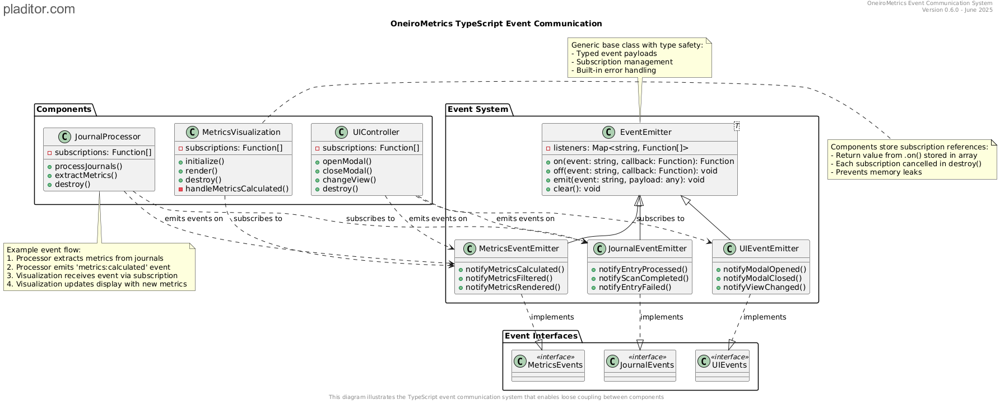

# TypeScript Adapter Pattern Guide

## Overview

This document provides practical guidance on using the adapter pattern in the OneiroMetrics codebase. The adapter pattern is a core architectural component that enables compatibility between different interface versions and provides type safety when accessing properties.

## Table of Contents

- [Core Concepts](#core-concepts)
- [When to Use Adapters](#when-to-use-adapters)
- [Implementation Patterns](#implementation-patterns)
- [Best Practices](#best-practices)
- [Examples](#examples)
- [Testing Adapters](#testing-adapters)

## Core Concepts

### What is the Adapter Pattern?

The adapter pattern in OneiroMetrics serves several critical purposes:

1. **Interface Compatibility**: Bridging between different versions of interfaces that have evolved over time
2. **Type Safety**: Ensuring type-safe access to properties that may have different shapes
3. **Default Values**: Providing sensible defaults when properties are missing
4. **Error Prevention**: Preventing runtime errors through proper validation and fallbacks

### Architectural Overview

The diagram below illustrates how the adapter pattern is implemented in the OneiroMetrics architecture:


This diagram shows:
- The relationship between legacy and modern interfaces
- How adapter utilities convert between different interface versions
- How client code uses adapters for backward compatibility

### Key Components

Our adapter implementation consists of:

- **Type Adapters**: Functions that convert between different interface versions
- **Property Access Helpers**: Utilities for safely accessing properties
- **Type Guards**: Functions that validate the shape of objects

## When to Use Adapters

Use adapter functions when:

1. **Accessing Legacy Data**: When working with settings or data that might come from an older version
2. **Cross-Component Communication**: When passing data between components that expect different shapes
3. **External Integrations**: When integrating with external APIs or plugins
4. **Migration Contexts**: When gradually updating code to use newer interfaces

### Type System Context

The adapter pattern works within our broader type system architecture. The diagram below shows how different interfaces relate to each other:


This diagram illustrates:
- The core interfaces that adapters must work with
- The relationship between different types in the system
- How helper utilities interact with these types

## Implementation Patterns

### Type Adapter Functions

Type adapter functions convert objects from one interface to another:

```typescript
/**
 * Adapts any settings object to ensure it conforms to CoreDreamMetricsSettings
 * @param source The source settings object (may be in any format)
 * @returns A settings object that conforms to CoreDreamMetricsSettings
 */
export function adaptToCoreDreamMetricsSettings(
  source: any
): CoreDreamMetricsSettings {
  // Create a new object with required properties
  const result: CoreDreamMetricsSettings = {
    projectNote: getProjectNotePath(source),
    selectedNotes: getSelectedNotes(source) || [],
    selectedFolder: getSelectedFolder(source) || '',
    selectionMode: getCompatibleSelectionMode(source),
    calloutName: getCalloutName(source) || 'dream-metrics',
    metrics: adaptMetrics(source),
    showRibbonButtons: getShowRibbonButtons(source),
    backupEnabled: isBackupEnabled(source),
    backupFolderPath: getBackupFolderPath(source) || './backups',
    logging: adaptLoggingConfig(source)
  };
  
  return result;
}
```

### Property Access Helpers

Property access helpers provide safe access to properties that might be missing:

```typescript
/**
 * Safely gets the project note path from any settings object
 * @param settings The settings object
 * @returns The project note path
 */
export function getProjectNotePath(settings: any): string {
  // Try both property names with fallback
  return settings?.projectNote || 
         settings?.projectNotePath || 
         '';
}
```

### Type Guards

Type guards validate the shape of objects:

```typescript
/**
 * Checks if a metric is enabled
 * @param metric The metric to check
 * @returns True if the metric is enabled
 */
export function isMetricEnabled(metric: any): boolean {
  // Handle both explicit enabled property and legacy format
  if (metric === undefined) return false;
  if (metric.enabled !== undefined) return !!metric.enabled;
  // Legacy metrics were enabled by default
  return true;
}
```

## Best Practices

### 1. Always Use Helper Functions for Property Access

Instead of directly accessing properties that might have different names or be missing, always use helper functions:

```typescript
// AVOID:
const projectNote = settings.projectNote || settings.projectNotePath || '';

// PREFER:
const projectNote = getProjectNotePath(settings);
```

### 2. Keep Adapter Functions Pure

Adapter functions should:
- Not modify the input object
- Return a new object
- Have no side effects
- Handle all potential input shapes

### 3. Document Both Interfaces

When creating adapter functions, document both the source and target interfaces:

```typescript
/**
 * @param source The source settings object following LegacySettings
 * @returns A settings object following ModernSettings
 */
```

### 4. Use Type Guards for Conditional Logic

When behavior depends on the shape of an object, use type guards:

```typescript
// AVOID:
if (metric.enabled || (metric.enabled === undefined && someCondition)) {
  // ...
}

// PREFER:
if (isMetricEnabled(metric)) {
  // ...
}
```

### 5. Provide Sensible Defaults

Always provide sensible defaults for missing properties:

```typescript
export function getMetricRange(metric: any): Range {
  if (!metric) return { min: 1, max: 5 };
  
  // Handle both modern and legacy formats
  if (metric.range) return metric.range;
  
  return {
    min: metric.min !== undefined ? metric.min : 1,
    max: metric.max !== undefined ? metric.max : 5
  };
}
```

## Examples

### Example 1: Adapting Metrics Data

```typescript
// Function to adapt a metrics object
export function adaptMetrics(source: any): Record<string, DreamMetric> {
  const result: Record<string, DreamMetric> = {};
  
  // Handle array format (legacy)
  if (Array.isArray(source?.metrics)) {
    source.metrics.forEach((metric: any) => {
      if (metric?.name) {
        result[metric.name] = adaptMetric(metric);
      }
    });
  } 
  // Handle record format (modern)
  else if (typeof source?.metrics === 'object') {
    Object.entries(source.metrics).forEach(([key, value]) => {
      result[key] = adaptMetric(value);
    });
  }
  
  // Ensure at least empty object if metrics are missing
  return result;
}

// Function to adapt a single metric
export function adaptMetric(source: any): DreamMetric {
  return {
    name: source?.name || 'Unknown Metric',
    icon: source?.icon || '📊',
    range: getMetricRange(source),
    description: source?.description || '',
    enabled: isMetricEnabled(source)
  };
}
```

### Example 2: Safe Property Access

```typescript
// Safe access pattern for nested properties
export function getNestedProperty(obj: any, path: string, defaultValue: any = undefined): any {
  const parts = path.split('.');
  let current = obj;
  
  for (const part of parts) {
    if (current === null || current === undefined) {
      return defaultValue;
    }
    current = current[part];
  }
  
  return current !== undefined ? current : defaultValue;
}

// Usage:
const detail = getNestedProperty(journalEntry, 'metrics.sensoryDetail.value', 0);
```

## Testing Adapters

Adapter functions should be thoroughly tested:

1. **Test with valid modern input**: Ensure adapters preserve data when given correctly formatted input
2. **Test with legacy input**: Ensure adapters correctly transform legacy formats
3. **Test with missing properties**: Ensure adapters provide correct defaults
4. **Test with invalid input**: Ensure adapters handle null, undefined, or wrongly-typed input

Example test:

```typescript
describe('adaptMetric', () => {
  it('should handle modern metric format', () => {
    const input = {
      name: 'Sensory Detail',
      icon: '👁️',
      range: { min: 1, max: 10 },
      description: 'Level of sensory detail',
      enabled: true
    };
    
    const result = adaptMetric(input);
    
    expect(result.name).toBe('Sensory Detail');
    expect(result.range.min).toBe(1);
    expect(result.range.max).toBe(10);
    expect(result.enabled).toBe(true);
  });
  
  it('should handle legacy metric format', () => {
    const input = {
      name: 'Sensory Detail',
      icon: '👁️',
      min: 1,
      max: 10,
      description: 'Level of sensory detail'
    };
    
    const result = adaptMetric(input);
    
    expect(result.name).toBe('Sensory Detail');
    expect(result.range.min).toBe(1);
    expect(result.range.max).toBe(10);
    expect(result.enabled).toBe(true); // Legacy metrics default to enabled
  });
  
  it('should provide defaults for missing properties', () => {
    const input = {
      name: 'Sensory Detail'
    };
    
    const result = adaptMetric(input);
    
    expect(result.name).toBe('Sensory Detail');
    expect(result.icon).toBe('📊'); // Default icon
    expect(result.range.min).toBe(1); // Default min
    expect(result.range.max).toBe(5); // Default max
    expect(result.description).toBe(''); // Default description
    expect(result.enabled).toBe(true); // Default enabled state
  });
  
  it('should handle null or undefined input', () => {
    const result = adaptMetric(null);
    
    expect(result.name).toBe('Unknown Metric');
    expect(result.range.min).toBe(1);
    expect(result.range.max).toBe(5);
    expect(result.enabled).toBe(false);
  });
});
```

By following these patterns and best practices, we ensure type safety, backward compatibility, and robust error handling throughout the codebase.

## Integration with Event System

The adapter pattern also plays an important role in our event communication system. When events carry data between components, adapters ensure the data is properly formatted for each receiver:



This diagram shows how:
- Events transport data between loosely coupled components
- Each component may expect data in a specific format
- Adapters can be used at the boundaries between components to ensure compatibility