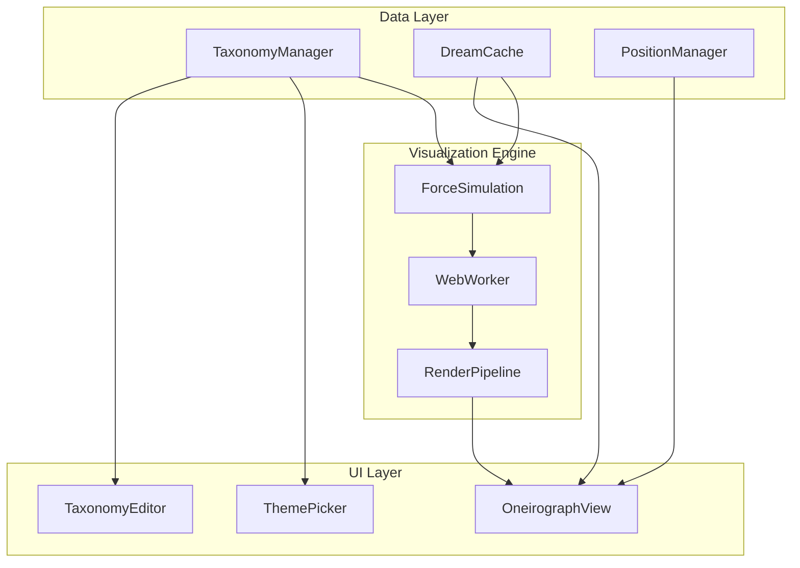

# Dream Taxonomy & Oneirograph Integration Plan

- **Document Version:** 1.0
- **Date:** August 2025
- **Status:** Planning
- **Priority:** High
- **Estimated Effort:** 8-10 weeks

## Executive Summary

This document outlines the integrated implementation plan for two complementary features: the Dream Taxonomy system and the Oneirograph visualization. Together, these features will provide OneiroMetrics users with a structured yet flexible framework for categorizing their dreams and a powerful visual interface for exploring their dreamscape.

The Dream Taxonomy provides a three-tier hierarchical organization (Clusters → Vectors → Themes), while the Oneirograph creates an interactive, force-directed graph visualization that spatially represents this hierarchy as a navigable "dream landscape."

## Table of Contents

1. [Vision & Goals](#vision--goals)
2. [Feature Overview](#feature-overview)
3. [Technical Architecture](#technical-architecture)
4. [Implementation Phases](#implementation-phases)
5. [User Experience Design](#user-experience-design)
6. [Performance Strategy](#performance-strategy)
7. [Testing & Quality Assurance](#testing--quality-assurance)
8. [Success Metrics](#success-metrics)
9. [Risk Mitigation](#risk-mitigation)
10. [Future Enhancements](#future-enhancements)

## Vision & Goals

### Primary Objectives

1. **Structured Organization**: Provide users with a meaningful way to categorize and understand their dream themes beyond flat lists
2. **Visual Exploration**: Enable intuitive navigation of dream data through spatial representation
3. **Progressive Complexity**: Offer immediate value with defaults while supporting advanced customization
4. **Seamless Integration**: Create a unified experience between taxonomy management and visualization

### Key Benefits

- **For New Users**: Immediate structure and guidance for dream categorization
- **For Power Users**: Deep customization and analytical capabilities
- **For Researchers**: Standardized framework for dream analysis and comparison
- **For the Community**: Shareable taxonomies and visualization patterns

## Feature Overview

### Dream Taxonomy System

A hierarchical classification system with three levels:

1. **Clusters** (14 default categories): Broad thematic domains
2. **Vectors** (60+ subcategories): Specific aspects within clusters
3. **Themes** (300+ items): Individual dream elements

**Key Capabilities:**
- Default taxonomy provided out-of-the-box
- Full customization via drag-and-drop interface
- Import/export for sharing
- Multi-vector theme support
- Backward compatibility with existing flat themes

### Oneirograph Visualization

An interactive, force-directed graph that visualizes dreams as nodes within the taxonomy structure:

**Key Features:**
- Spatial clustering based on taxonomy hierarchy
- Progressive detail levels (zoom-dependent)
- Real-time filtering and search
- In-situ dream content expansion
- Connection lines for shared themes
- Performance optimization for large datasets

## Technical Architecture

### Data Models

```typescript
// Taxonomy Structure
interface TaxonomyCluster {
  id: string;
  name: string;
  description?: string;
  color: string;
  vectors: TaxonomyVector[];
  position?: { x: number; y: number }; // For custom layouts
}

interface TaxonomyVector {
  id: string;
  name: string;
  description?: string;
  themes: TaxonomyTheme[];
  parentClusterId: string;
}

interface TaxonomyTheme {
  id: string;
  name: string;
  aliases?: string[]; // Alternative names/spellings
  vectorIds: string[]; // Support multi-vector assignment
  customMetadata?: Record<string, any>;
}

// Visualization Data
interface OneirographNode {
  id: string; // Dream entry ID
  date: Date;
  title: string;
  themes: ThemeAssignment[];
  position: { x: number; y: number };
  cluster: string;
  vectors: string[];
}

interface ThemeAssignment {
  themeId: string;
  clusterId: string;
  vectorId: string;
  confidence?: number; // For future ML features
}
```

### Storage Architecture

```typescript
// File Structure
plugin-data/
├── taxonomy/
│   ├── default-taxonomy.json    // Shipped with plugin
│   ├── user-taxonomy.json       // User customizations
│   └── taxonomy-backup-{date}.json
├── oneirograph/
│   ├── layout-cache.json        // Cached node positions
│   ├── view-state.json          // Zoom, pan, filters
│   └── performance-metrics.json
└── settings.json                // Plugin settings
```

### Component Architecture



## Implementation Phases

### Phase 1: Taxonomy Foundation (Weeks 1-2)

**Goals**: Establish core taxonomy system with basic UI

**Tasks**:
1. **Data Model Implementation**
   - Create TypeScript interfaces and classes
   - Implement taxonomy storage/retrieval
   - Build default taxonomy dataset
   - Add migration support for existing themes

2. **Taxonomy Manager Service**
   - CRUD operations for clusters/vectors/themes
   - Import/export functionality
   - Validation and consistency checks
   - Theme search and lookup

3. **Basic Settings UI**
   - Read-only taxonomy viewer
   - Expand/collapse tree navigation
   - Search functionality
   - Theme count indicators

**Deliverables**:
- Working taxonomy data model
- Default taxonomy loaded in settings
- Basic tree view UI
- Migration for existing dream themes

### Phase 2: Taxonomy Editing (Weeks 3-4)

**Goals**: Full editing capabilities for taxonomy customization

**Tasks**:
1. **Drag-and-Drop Editor**
   - Move themes between vectors
   - Reorder vectors within clusters
   - Create/rename/delete operations
   - Undo/redo support

2. **Advanced Features**
   - Multi-vector theme assignment
   - Bulk operations (move multiple themes)
   - Theme aliasing and synonyms
   - Custom cluster colors

3. **Theme Picker Integration**
   - Hierarchical theme selection in dream entries
   - Auto-complete with full path display
   - Recent/frequent themes section
   - Create new theme inline

**Deliverables**:
- Full taxonomy editor
- Integrated theme picker
- Import/export functionality
- User documentation

### Phase 3: Basic Oneirograph (Weeks 5-6)

**Goals**: Minimum viable graph visualization

**Tasks**:
1. **View Infrastructure**
   - Create OneirographView extending ItemView
   - Canvas setup with pan/zoom
   - Basic D3.js integration
   - Loading states and error handling

2. **Cluster-Level Visualization**
   - Force simulation for cluster positioning
   - Convex hull rendering for cluster boundaries
   - Cluster labels and colors
   - Basic node rendering (dots)

3. **Core Interactions**
   - Click cluster to zoom in
   - Pan and zoom controls
   - Node hover tooltips
   - Basic performance monitoring

**Deliverables**:
- Working Oneirograph view
- Cluster-level visualization
- Basic navigation
- Performance baseline

### Phase 4: Full Oneirograph (Weeks 7-8)

**Goals**: Complete visualization with all planned features

**Tasks**:
1. **Vector & Theme Visualization**
   - Sub-clustering within clusters
   - Vector boundary rendering
   - Theme-based node positioning
   - Connection lines implementation

2. **Advanced Interactions**
   - Expand/collapse clusters and vectors
   - Dream content in-situ expansion
   - Live filtering and search
   - Keyboard navigation

3. **Performance Optimization**
   - Web Worker integration
   - Level-of-detail rendering
   - Viewport culling
   - Canvas layering

**Deliverables**:
- Full hierarchical visualization
- All interaction features
- Optimized performance
- Accessibility compliance

### Phase 5: Integration & Polish (Weeks 9-10)

**Goals**: Seamless integration and production readiness

**Tasks**:
1. **Cross-Feature Integration**
   - Sync taxonomy changes to graph
   - Bidirectional navigation
   - Unified search/filter
   - Settings persistence

2. **Analytics Integration**
   - Theme distribution charts
   - Cluster/vector statistics
   - Orphan theme detection
   - Usage patterns

3. **Polish & Documentation**
   - UI/UX refinements
   - Performance tuning
   - User guide creation
   - Video tutorials

**Deliverables**:
- Fully integrated features
- Analytics dashboards
- Complete documentation
- Release candidate

## User Experience Design

### Taxonomy Editor Workflow

```
1. User opens Settings → Dream Taxonomy
2. Sees tree view with clusters expanded
3. Can drag themes between vectors
4. Changes reflected immediately
5. Auto-save with undo support
6. Export to share with others
```

### Oneirograph Navigation Flow

```
1. User opens Oneirograph view
2. Sees high-level cluster map
3. Clicks cluster to zoom in
4. Sees vectors within cluster
5. Clicks vector to see themes
6. Clicks node to read dream
7. Uses sidebar for filtering
```

### Key UI Principles

1. **Progressive Disclosure**: Start simple, reveal complexity
2. **Direct Manipulation**: Drag-and-drop, click-to-zoom
3. **Immediate Feedback**: Real-time updates, smooth animations
4. **Contextual Help**: Tooltips, guided tours
5. **Keyboard Accessible**: Full keyboard navigation

## Performance Strategy

### Taxonomy Performance

- **Lazy Loading**: Load vectors/themes on demand
- **Indexing**: Build search indices for fast lookup
- **Caching**: Cache computed hierarchies
- **Debouncing**: Batch rapid edits

### Oneirograph Performance

#### Rendering Targets
| Dreams | Initial Load | Pan/Zoom | Filter |
|--------|-------------|----------|---------|
| 100    | <500ms      | 60 FPS   | <50ms   |
| 1,000  | <2s         | 30 FPS   | <100ms  |
| 10,000 | <5s         | 20 FPS   | <200ms  |

#### Optimization Techniques

1. **Web Workers**: Offload force calculations
2. **Canvas Layers**: Separate static/dynamic content
3. **Spatial Indexing**: Quadtree for hit detection
4. **LOD System**: Detail based on zoom level
5. **Incremental Updates**: Only recalculate changes

## Testing & Quality Assurance

### Test Categories

1. **Unit Tests**
   - Taxonomy CRUD operations
   - Force simulation calculations
   - Data model validation
   - Performance benchmarks

2. **Integration Tests**
   - Theme picker ↔ Taxonomy
   - Taxonomy changes → Graph updates
   - Settings persistence
   - Migration scenarios

3. **E2E Tests**
   - Complete user workflows
   - Cross-browser compatibility
   - Performance under load
   - Accessibility compliance

### Test Data Sets

- **Small**: 10 dreams, 20 themes
- **Medium**: 100 dreams, 50 themes
- **Large**: 1,000 dreams, 200 themes
- **Stress**: 10,000 dreams, 300+ themes

## Success Metrics

### Quantitative Metrics

| Metric | Target | Measurement |
|--------|--------|-------------|
| Taxonomy adoption | 80% of users customize | Settings telemetry |
| Oneirograph usage | 50% weekly active | View open events |
| Performance | <2s load for 1k dreams | Performance API |
| Theme organization | 90% themes categorized | Theme assignment rate |

### Qualitative Metrics

- User feedback scores >4.5/5
- Reduced support questions about organization
- Community taxonomy sharing
- Power user testimonials

## Risk Mitigation

### Technical Risks

| Risk | Impact | Mitigation |
|------|--------|------------|
| Performance degradation | High | Progressive loading, Web Workers |
| Browser compatibility | Medium | Polyfills, graceful degradation |
| Data corruption | High | Validation, backups, migrations |
| Memory leaks | Medium | Proper cleanup, monitoring |

### User Experience Risks

| Risk | Impact | Mitigation |
|------|--------|------------|
| Complexity overwhelm | High | Progressive disclosure, tutorials |
| Migration anxiety | Medium | Non-destructive, reversible |
| Learning curve | Medium | Defaults, guided tours |
| Feature discovery | Low | Prominent UI, documentation |

## Future Enhancements

### Version 2.0 Candidates

1. **ML-Powered Features**
   - Auto-categorization suggestions
   - Theme relationship discovery
   - Anomaly detection
   - Trend prediction

2. **Collaboration Features**
   - Taxonomy marketplace
   - Shared dreamscapes
   - Research templates
   - Community insights

3. **Advanced Visualizations**
   - Time-based animations
   - 3D graph option
   - VR exploration mode
   - Alternative layouts

4. **Integration Expansions**
   - Export to graph databases
   - Academic paper generation
   - API for researchers
   - Mobile companion app

### Long-term Vision

Create an ecosystem where:
- Researchers share standardized taxonomies
- Communities explore collective dreamscapes
- Individuals gain deep insights through visualization
- The tool becomes essential for dream work

## Appendices

### Appendix A: Default Taxonomy Structure

#### Cluster 1: Action & Agency
**Vector: Mission & Strategy**
- `Ambition` - Dreams of achieving goals, reaching heights, accomplishing great feats
- `Challenge` - Facing tests, competitions, obstacles to overcome
- `Choice` - Standing at crossroads, making important decisions, selecting paths
- `Coordination` - Organizing groups, synchronizing efforts, teamwork scenarios
- `Intervention` - Stepping in to help, preventing disasters, changing outcomes
- `Leadership` - Leading others, taking charge, guiding groups
- `Mission` - Having a specific quest, important task, or purpose to fulfill
- `Outreach` - Helping others, extending assistance, making connections
- `Responsibility` - Being accountable, carrying burdens, fulfilling duties
- `Strategy` - Planning approaches, solving complex problems, tactical thinking

**Vector: Pursuit & Consequence**
- `Acquisition` - Gathering resources, collecting items, obtaining necessities
- `Escape` - Breaking free, leaving danger, finding exits
- `Evasion` - Dodging threats, avoiding capture, staying hidden
- `Maneuver` - Navigating obstacles, strategic movement, skillful navigation
- `Pursuit` - Being chased, hunting something, following targets
- `Traversal` - Crossing territories, moving through spaces, journeying
- `Urgency` - Racing against time, emergency situations, critical deadlines

#### Cluster 2: Boundaries & Barriers
**Vector: Confinement**
- `Boundaries`
- `Confinement`
- `Constraint`
- `Containment`
- `Obstruction`
- `Sanctuary`

**Vector: Breach & Collapse**
- `Breach`
- `Chaos`
- `Collapse`
- `Deconstruction`
- `Reordering`

#### Cluster 3: Conflict, Obstacles, and Resolution
**Vector: Open Conflict**
- `Aggression`
- `Conflict`
- `Confrontation`
- `Contention`
- `Violence`

**Vector: Threat & Danger**
- `Peril`
- `Danger`
- `Predation`
- `Threat`

**Vector: Overcoming Obstacles**
- `Struggle`
- `Resistance`
- `Resolve`
- `Remediation`
- `Sacrifice`
- `Endurance`
- `Persistence`
- `Resilience`

**Vector: Consequence & Outcome**
- `Consequences`
- `Setback`
- `Ordeal`
- `Disruption`
- `Predicament`
- `Unraveling`

**Vector: Suppression & Oppression**
- `Oppression`
- `Subjugation`

#### Cluster 4: Control, Power, and Agency
**Vector: Assertion of Power**
- `Agency`
- `Autonomy`
- `Claim`
- `Command`
- `Control`
- `Domination`
- `Empowerment`
- `Projection`
- `Unleashing`

**Vector: Authority & Systems**
- `Authority`
- `Custodianship`
- `Duty`
- `Obedience`
- `Oversight`
- `Surveillance`

**Vector: Loss of Control**
- `Distrust`
- `Impotence`
- `Manipulation`
- `Powerlessness`
- `Vulnerability`

**Vector: Moral and Social Power**
- `Contribution`
- `Judgment`
- `Reconciliation`
- `Responsibility`

#### Cluster 5: Creation & Emergence
**Vector: Manifestation & Reordering**
- `Creation`
- `Emergence`
- `Manifestation`
- `Novelty`
- `Permeation`
- `Reordering`

**Vector: Replication & Uniqueness**
- `Pattern`
- `Replication`
- `Ubiquity`

**Vector: Potential & Fertility**
- `Fertility`
- `Nurturing`
- `Potential`
- `Provision`

#### Cluster 6: Identity & Consciousness
**Vector: Self & Detachment**
- `Detachment` - Feeling disconnected, observing from outside, emotional distance
- `Discomfort` - Physical or emotional unease, awkward situations, being out of place
- `Disgust` - Revulsion, rejection, encountering repulsive elements
- `Disorientation` - Confusion about location/identity, losing bearings, unclear reality
- `Impassivity` - Emotional numbness, inability to react, frozen feelings
- `Resignation` - Accepting fate, giving up, surrendering to circumstances
- `Self-Discovery` - Learning about oneself, revelations, finding identity

**Vector: Transformation & Change**
- `Adaptation` - Adjusting to new situations, evolving abilities, fitting in
- `Alteration` - Changing form, modifying appearance, shifting states
- `Ascension` - Rising upward, spiritual elevation, reaching higher planes
- `Augmentation` - Gaining new abilities, enhancement, becoming more
- `Awakening` - Realizing truth, becoming aware, enlightenment moments
- `Evolution` - Gradual development, improving, advancing stages
- `Initiation` - Beginning journeys, rites of passage, entering new phases
- `Regeneration` - Healing, renewal, restoration of what was lost
- `Shift` - Sudden changes, reality alterations, perspective switches
- `Transformation` - Complete metamorphosis, fundamental changes, becoming other
- `Transition` - Moving between states, in-between phases, crossing thresholds

**Vector: Fragmentation & Integration**
- `Abstraction`
- `Assimilation`
- `Blurring`
- `Duality`
- `Integration`
- `Symbiosis`

**Vector: Liberation & Unrestraint**
- `Emancipation`
- `Liberation`
- `Unrestraint`
- `Exclusion`

**Vector: Presence & Affect**
- `Anticipation`
- `Confidence`
- `Presence`

**Vector: Inheritance & Roots**
- `Ancestry`
- `Legacy`
- `Origin`

#### Cluster 7: Journeys, Movement, and Process
**Vector: Physical Journeys**
- `Exploration`
- `Invasion`
- `Journey`
- `Passage`
- `Time Travel`
- `Traversal`

**Vector: Repetitive Processes**
- `Cycle`
- `Performance`
- `Recursion`
- `Repetition`
- `Ritual`

**Vector: Navigation & Maneuver**
- `Maneuver`
- `Navigation`

**Vector: Mental Journeys**
- `Nostalgia`
- `Re-experience`
- `Recollection`
- `Seeking Clarity`

#### Cluster 8: Perception, Reality, and Deception
**Vector: Observation & Awareness**
- `Awareness`
- `Observation`
- `Perception`
- `Scrutiny`
- `Vigilance`

**Vector: Revelation & Discovery**
- `Discovery`
- `Disclosure`
- `Encounter`
- `Incursion`
- `Origin`
- `Revelation`

**Vector: Truth vs. Illusion**
- `Authenticity`
- `Deception`
- `Discrepancy`
- `Disillusionment`
- `Elusiveness`
- `Misunderstanding`
- `Perspective`
- `Reality`
- `Simulation`

**Vector: The Unknowable**
- `Dichotomy`
- `Enigma`
- `Foreboding`
- `Omnipotence`

**Vector: Concealment & Unraveling**
- `Concealment`
- `Evasion`
- `Exposure`
- `Unraveling`

#### Cluster 9: Relationships & Connection
**Vector: Forming Connections**
- `Affection`
- `Connection`
- `Interconnection`
- `Intimacy`
- `Reconnection`
- `Relationships`

**Vector: Social & Emotional Dynamics**
- `Approval`
- `Communication`
- `Empathy`
- `Judgment`
- `Longing`
- `Negotiation`
- `Reconciliation`

**Vector: Social Division**
- `Disconnection`
- `Disengagement`
- `Exclusion`
- `Impassivity`

#### Cluster 10: Resources & Provision
**Vector: Management & Maintenance**
- `Documentation`
- `Measurement`
- `Preservation`
- `Structure`

**Vector: Reliance & Support**
- `Assistance`
- `Reliance`
- `Support`

**Vector: Provision & Scarcity**
- `Acquisition`
- `Extraction`
- `Nurturing`
- `Provision`

#### Cluster 11: Abstract Concepts and Environments
**Vector: Scale & Scope**
- `Abundance`
- `Density`
- `Expansion`
- `Magnitude`
- `Overwhelm`

**Vector: Otherworld & The Surreal**
- `Otherworld`
- `Dichotomy`
- `Enigma`
- `Contamination`
- `Esotericism`
- `Mysticism`

#### Cluster 12: Physical & Metaphysical
**Vector: Physical & Bodily Experience**
- `Cleansing`
- `Contamination`
- `Discomfort`
- `Disgust`
- `Extremity`
- `Fearlessness`
- `Grief`
- `Physicality`
- `Pain`
- `Sensation`
- `Emotions`

#### Cluster 13: Nature & Elements
**Vector: Natural Forces**
- `Storm` - Weather phenomena, natural power, environmental chaos
- `Fire` - Burning, destruction, transformation through heat
- `Water` - Floods, drowning, cleansing, emotional depths
- `Earth` - Grounding, stability, burial, growth
- `Air` - Wind, breath, freedom, communication

**Vector: Natural Environments**
- `Forest` - Getting lost, finding paths, natural sanctuary
- `Ocean` - Vast unknown, depths, waves of emotion
- `Mountain` - Climbing, achievement, obstacles, perspective
- `Desert` - Isolation, survival, spiritual journey
- `Garden` - Cultivation, beauty, paradise, growth

#### Cluster 14: Technology & Digital
**Vector: Digital Existence**
- `Virtual Reality` - Simulated worlds, questioning reality
- `Social Media` - Connection/disconnection, public persona
- `Gaming` - Competition, alternate lives, achievement
- `Glitches` - Reality breaking down, system errors

**Vector: Technological Control**
- `Automation` - Loss of human control, efficiency
- `Surveillance Tech` - Being watched through devices
- `AI/Robots` - Non-human intelligence, replacement fears
- `Connectivity` - Networks, being plugged in/unplugged

### Common Dream Scenario Mappings

Understanding how common dream scenarios map to the taxonomy helps users quickly categorize their dreams:

- **Being Chased**: Cluster 3: Conflict, Obstacles, and Resolution → Threat & Danger → `Pursuit`, `Evasion`, `Danger`
- **Flying**: Cluster 6: Identity & Consciousness → Liberation & Unrestraint → `Emancipation`, `Unrestraint`; or Cluster 4: Control, Power, and Agency → Assertion of Power → `Empowerment`
- **Falling**: Cluster 4: Control, Power, and Agency → Loss of Control → `Powerlessness`, `Vulnerability`
- **Being Naked in Public**: Cluster 6: Identity & Consciousness → Self & Detachment → `Discomfort`, `Disorientation`; Cluster 8: Perception, Reality, and Deception → Concealment & Unraveling → `Exposure`
- **Death/Dying**: Cluster 6: Identity & Consciousness → Transformation & Change → `Transition`, `Transformation`
- **Lost/Can't Find Something**: Cluster 7: Journeys, Movement, and Process → Navigation & Maneuver → `Navigation`; Cluster 6: Identity & Consciousness → Self & Detachment → `Disorientation`
- **Taking a Test**: Cluster 1: Action & Agency → Mission & Strategy → `Challenge`, `Strategy`; Cluster 4: Control, Power, and Agency → Loss of Control → `Vulnerability`
- **Meeting Deceased People**: Cluster 9: Relationships & Connection → Forming Connections → `Reconnection`; Cluster 6: Identity & Consciousness → Inheritance & Roots → `Ancestry`, `Legacy`
- **Natural Disasters**: Cluster 2: Boundaries & Barriers → Breach & Collapse → `Chaos`, `Collapse`; Cluster 3: Conflict, Obstacles, and Resolution → Threat & Danger → `Peril`
- **Being Late**: Cluster 1: Action & Agency → Pursuit & Consequence → `Urgency`; Cluster 4: Control, Power, and Agency → Loss of Control → `Powerlessness`
- **Technology Nightmares**: Cluster 14: Technology & Digital → Digital Existence → `Glitches`; Cluster 14: Technology & Digital → Technological Control → `Automation`
- **Nature Dreams**: Cluster 13: Nature & Elements → Natural Environments → Various based on specific environment

### Appendix B: API Documentation

[Detailed API specs for taxonomy and graph systems]

### Appendix C: Performance Benchmarks

[Detailed performance testing methodology and baselines]

### Appendix D: Accessibility Guidelines

[WCAG 2.1 AA compliance checklist and implementation notes]

---

**Next Steps**:
1. Review and approve plan
2. Assign to development team
3. Set up project tracking
4. Begin Phase 1 implementation