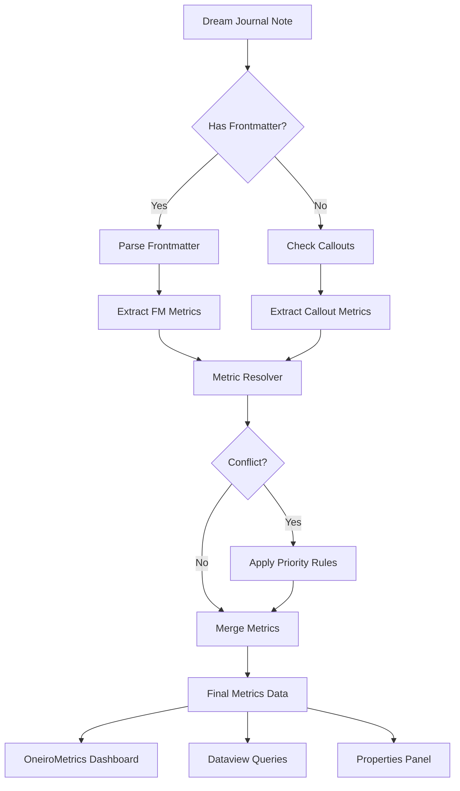

# Frontmatter Properties Support for OneiroMetrics

- **Document Version:** 1.0
- **Date:** August 15, 2025
- **Status:** Planning
- **Priority:** High
- **Estimated Effort:** 3-4 weeks

## Executive Summary

This document outlines the implementation plan for adding frontmatter property support to OneiroMetrics, enabling users to store and track dream metrics directly in note frontmatter. This feature will complement the existing callout-based system while providing better integration with Obsidian's native features and third-party plugins like Dataview.

## Table of Contents

1. [Feature Overview](#feature-overview)
2. [User Stories](#user-stories)
3. [Technical Architecture](#technical-architecture)
4. [Implementation Phases](#implementation-phases)
5. [Settings UI Modifications](#settings-ui-modifications)
6. [Parser Integration](#parser-integration)
7. [Data Flow and Priority System](#data-flow-and-priority-system)
8. [Testing Strategy](#testing-strategy)
9. [User Experience Considerations](#user-experience-considerations)
10. [Integration Examples](#integration-examples)
11. [Risk Assessment and Mitigation](#risk-assessment-and-mitigation)
12. [Performance Considerations](#performance-considerations)
13. [Migration Path](#migration-path)
14. [Success Metrics](#success-metrics)

## Feature Overview

### Problem Statement

Currently, OneiroMetrics exclusively uses callout blocks to store dream metrics within note content. While this approach works well for narrative-style journaling, it presents limitations:

- **Limited Dataview Integration**: Callout-based metrics are not easily queryable through Dataview
- **No Properties Panel Support**: Users cannot view or edit metrics through Obsidian's Properties panel
- **Duplication of Data**: Users maintaining both frontmatter and callouts for different purposes
- **Template Compatibility**: Many existing templates use frontmatter for metadata storage

### Proposed Solution

Implement comprehensive frontmatter property support that:
- Allows users to specify frontmatter property names for each metric
- Supports both compact array format and expanded list format
- Maintains full backward compatibility with callout-based metrics
- Provides intelligent conflict resolution when both sources exist
- Enables seamless integration with Obsidian's ecosystem

### Key Benefits

- **Native Integration**: Leverage Obsidian's built-in properties system
- **Enhanced Queryability**: Direct Dataview queries without complex parsing
- **Improved Workflow**: Edit metrics through Properties panel or source mode
- **Template Flexibility**: Support existing template ecosystems
- **Data Portability**: Standard YAML format for better interoperability

## User Stories

### Primary User Stories

1. **As a dream journaler**, I want to store my dream metrics in frontmatter properties so that I can query them easily with Dataview and see them in the Properties panel.

2. **As a template creator**, I want to define frontmatter properties for dream metrics so that users can fill them out using standard Obsidian interfaces.

3. **As an existing user**, I want to migrate my callout-based metrics to frontmatter properties without losing any data or functionality.

4. **As a power user**, I want to use both frontmatter and callouts for different metrics based on my workflow preferences.

5. **As a data analyst**, I want to export and analyze my dream metrics using standard YAML parsing tools outside of Obsidian.

### Edge Cases and Advanced Scenarios

1. **Mixed Format User**: Uses frontmatter for quantitative metrics (lucidity level, vividness) and callouts for narrative metrics (themes, characters)

2. **Template Switcher**: Switches between different journal templates that use different property naming conventions

3. **Bulk Editor**: Needs to update metrics across multiple dream entries efficiently

4. **Integration User**: Combines OneiroMetrics with other plugins that also use frontmatter properties

## Technical Architecture

### Core Design Principles

1. **Non-Breaking Changes**: All existing functionality must continue to work without modification
2. **Progressive Enhancement**: Frontmatter support is additive, not replacement
3. **Performance First**: No degradation for users who don't enable frontmatter
4. **Type Safety**: Full TypeScript support with strict typing
5. **Extensibility**: Easy to add new property types and formats

### Component Overview

```typescript
// Core interfaces for frontmatter support
interface FrontmatterMetricConfig {
    metricName: string;           // Internal metric identifier
    propertyName: string;          // Frontmatter property name
    format: 'single' | 'array';   // Value format
    arrayFormat?: 'compact' | 'expanded'; // For array types
    enabled: boolean;
    priority: number;              // Resolution priority (1-100)
    autoDetectType?: boolean;      // Auto-detect if property is array/single
    coerceType?: boolean;          // Convert single values to arrays if needed
}

interface FrontmatterParser {
    parse(content: string): FrontmatterData;
    update(content: string, data: FrontmatterData): string;
    validate(data: FrontmatterData, config: FrontmatterMetricConfig[]): ValidationResult;
}

interface MetricSource {
    type: 'frontmatter' | 'callout' | 'hybrid';
    getPriority(): number;
    extractMetrics(file: TFile): Promise<DreamMetricData>;
    updateMetrics(file: TFile, metrics: DreamMetricData): Promise<void>;
}

interface MetricResolver {
    resolve(sources: MetricSource[]): DreamMetricData;
    detectConflicts(sources: MetricSource[]): ConflictReport[];
    merge(primary: DreamMetricData, secondary: DreamMetricData): DreamMetricData;
}
```

### Data Flow Architecture



### System Integration Points

1. **Parser Layer**: Enhanced to handle both frontmatter and callout sources
2. **Settings System**: Extended metric configuration with property mappings
3. **UI Components**: Updated to show metric source indicators
4. **Export System**: Modified to handle dual-source metrics
5. **Template System**: Enhanced to generate frontmatter-based templates

## Implementation Phases

### Phase 1: Core Infrastructure (Week 1)

#### 1.1 Frontmatter Parser Implementation

```typescript
export class FrontmatterPropertyParser implements FrontmatterParser {
    private yamlParser: YAMLParser;
    private validator: PropertyValidator;
    
    constructor(private app: App, private logger: ILogger) {
        this.yamlParser = new YAMLParser();
        this.validator = new PropertyValidator();
    }
    
    parse(content: string): FrontmatterData {
        const match = content.match(/^---\n([\s\S]*?)\n---/);
        if (!match) return {};
        
        try {
            const yaml = match[1];
            const data = this.yamlParser.parse(yaml);
            return this.normalizeData(data);
        } catch (error) {
            this.logger.error('Frontmatter', 'Failed to parse frontmatter', error);
            return {};
        }
    }
    
    private normalizeData(data: any): FrontmatterData {
        const normalized: FrontmatterData = {};
        
        for (const [key, value] of Object.entries(data)) {
            if (Array.isArray(value)) {
                // Handle both compact and expanded formats
                normalized[key] = this.normalizeArray(value);
            } else {
                normalized[key] = value;
            }
        }
        
        return normalized;
    }
    
    private normalizeArray(value: any[]): any[] {
        // Handle Obsidian's list format (with dashes)
        return value.map(item => {
            if (typeof item === 'string' && item.startsWith('- ')) {
                return item.substring(2);
            }
            return item;
        });
    }
}
```

#### 1.2 Metric Source Abstraction

```typescript
export class FrontmatterMetricSource implements MetricSource {
    readonly type = 'frontmatter';
    
    constructor(
        private parser: FrontmatterPropertyParser,
        private config: FrontmatterMetricConfig[],
        private app: App
    ) {}
    
    async extractMetrics(file: TFile): Promise<DreamMetricData> {
        const content = await this.app.vault.read(file);
        const frontmatter = this.parser.parse(content);
        const metrics: DreamMetricData = this.createEmptyMetrics();
        
        for (const metricConfig of this.config) {
            if (!metricConfig.enabled) continue;
            
            const propertyValue = frontmatter[metricConfig.propertyName];
            if (propertyValue !== undefined) {
                metrics[metricConfig.metricName] = this.convertValue(
                    propertyValue,
                    metricConfig
                );
            }
        }
        
        return metrics;
    }
    
    private convertValue(value: any, config: FrontmatterMetricConfig): any {
        // Auto-detect type if enabled
        if (config.autoDetectType) {
            if (Array.isArray(value)) {
                return value;
            } else if (typeof value === 'string' && value.includes(',')) {
                // Handle comma-separated values
                return value.split(',').map(v => v.trim());
            }
            return value;
        }
        
        // Use configured format
        if (config.format === 'array') {
            if (Array.isArray(value)) {
                return value;
            } else if (config.coerceType && value !== undefined && value !== null) {
                // Convert single value to array if coercion enabled
                return [value];
            }
        }
        
        // For single format, extract first item if array provided
        if (config.format === 'single' && Array.isArray(value)) {
            return value[0];
        }
        
        return value;
    }
    
    getPriority(): number {
        // Average priority of all configured metrics
        const total = this.config.reduce((sum, c) => sum + c.priority, 0);
        return total / this.config.length;
    }
}
```

### Phase 2: Settings UI Integration (Week 1-2)

#### 2.1 Type Flexibility and Smart Detection

The system will provide flexible type handling rather than hard-coding property types:

1. **Auto-Detection Mode**: The system can automatically detect whether a property contains single values or arrays
2. **User Configuration**: Users can manually specify the expected format for each metric
3. **Type Coercion**: Optional conversion between formats (e.g., single value → array)
4. **Graceful Handling**: The system adapts to whatever format the user provides

Example configurations:
```typescript
// Themes metric - flexible array handling
{
    metricName: 'themes',
    propertyName: 'dream-themes',
    format: 'array',
    autoDetectType: true,  // Accepts both arrays and comma-separated strings
    coerceType: true       // Single theme becomes array of one
}

// Lucidity metric - expects single value
{
    metricName: 'lucidity',
    propertyName: 'dream-lucidity-level',
    format: 'single',
    autoDetectType: false,
    coerceType: false
}

// Characters metric - smart array detection
{
    metricName: 'characters',
    propertyName: 'dream-characters-list',
    format: 'array',
    autoDetectType: true,  // Handles: ["A", "B"] or "A, B" or "A"
    coerceType: true
}
```

#### 2.2 Enhanced Metric Settings Interface

```typescript
export class MetricPropertySettings {
    private containerEl: HTMLElement;
    private settings: DreamMetricsSettings;
    
    render(containerEl: HTMLElement): void {
        this.containerEl = containerEl;
        
        // Header with toggle
        new Setting(containerEl)
            .setName('Frontmatter Properties')
            .setDesc('Configure frontmatter property mappings for metrics')
            .addToggle(toggle => toggle
                .setValue(this.settings.frontmatterEnabled)
                .onChange(value => {
                    this.settings.frontmatterEnabled = value;
                    this.renderMetricMappings();
                })
            );
        
        if (this.settings.frontmatterEnabled) {
            this.renderMetricMappings();
            this.renderPrioritySettings();
            this.renderFormatSettings();
        }
    }
    
    private renderMetricMappings(): void {
        const mappingContainer = this.containerEl.createDiv('metric-mappings');
        
        for (const metric of this.settings.dreamMetrics) {
            const config = this.getOrCreateConfig(metric.name);
            
            new Setting(mappingContainer)
                .setName(metric.name)
                .setDesc(`Map to frontmatter property`)
                .addText(text => text
                    .setPlaceholder('property-name')
                    .setValue(config.propertyName || '')
                    .onChange(value => {
                        config.propertyName = value;
                        this.saveSettings();
                    })
                )
                .addDropdown(dropdown => dropdown
                    .addOption('single', 'Single Value')
                    .addOption('array', 'Multiple Values')
                    .setValue(config.format || 'single')
                    .onChange(value => {
                        config.format = value as 'single' | 'array';
                        this.saveSettings();
                    })
                )
                .addToggle(toggle => toggle
                    .setValue(config.enabled)
                    .onChange(value => {
                        config.enabled = value;
                        this.saveSettings();
                    })
                );
        }
    }
    
    private renderPrioritySettings(): void {
        new Setting(this.containerEl)
            .setName('Conflict Resolution')
            .setDesc('Choose which source takes priority when both exist')
            .addDropdown(dropdown => dropdown
                .addOption('frontmatter', 'Frontmatter First')
                .addOption('callout', 'Callout First')
                .addOption('newest', 'Most Recent')
                .addOption('manual', 'Ask Each Time')
                .setValue(this.settings.metricPriority || 'frontmatter')
                .onChange(value => {
                    this.settings.metricPriority = value;
                    this.saveSettings();
                })
            );
    }
}
```

#### 2.2 Visual Configuration Helper

```typescript
export class PropertyMappingWizard extends Modal {
    private result: FrontmatterMetricConfig[];
    
    constructor(
        app: App,
        private existingConfig: FrontmatterMetricConfig[],
        private sampleFile?: TFile
    ) {
        super(app);
    }
    
    onOpen(): void {
        const { contentEl } = this;
        contentEl.empty();
        
        contentEl.createEl('h2', { text: 'Frontmatter Property Mapping Wizard' });
        
        // Auto-detection section
        if (this.sampleFile) {
            this.renderAutoDetection();
        }
        
        // Manual configuration
        this.renderManualConfiguration();
        
        // Preview section
        this.renderPreview();
        
        // Action buttons
        this.renderActions();
    }
    
    private async renderAutoDetection(): Promise<void> {
        const detectionEl = this.contentEl.createDiv('auto-detection');
        detectionEl.createEl('h3', { text: 'Detected Properties' });
        
        const content = await this.app.vault.read(this.sampleFile);
        const frontmatter = this.app.metadataCache.getFileCache(this.sampleFile)?.frontmatter;
        
        if (frontmatter) {
            const suggestions = this.generateSuggestions(frontmatter);
            this.renderSuggestions(detectionEl, suggestions);
        }
    }
    
    private generateSuggestions(frontmatter: any): PropertySuggestion[] {
        const suggestions: PropertySuggestion[] = [];
        const metricKeywords = ['lucidity', 'vividness', 'emotion', 'clarity', 'recall', 'themes', 'characters'];
        
        for (const [key, value] of Object.entries(frontmatter)) {
            const lowerKey = key.toLowerCase();
            
            for (const keyword of metricKeywords) {
                if (lowerKey.includes(keyword)) {
                    suggestions.push({
                        propertyName: key,
                        suggestedMetric: this.findClosestMetric(keyword),
                        confidence: this.calculateConfidence(key, value, keyword),
                        sampleValue: value
                    });
                }
            }
        }
        
        return suggestions;
    }
}
```

### Phase 3: Parser Integration (Week 2)

#### 3.1 Universal Metrics Calculator Enhancement

```typescript
export class EnhancedMetricsCalculator extends UniversalMetricsCalculator {
    private frontmatterSource: FrontmatterMetricSource;
    private calloutSource: CalloutMetricSource;
    private resolver: MetricResolver;
    
    constructor(app: App, plugin: DreamMetricsPlugin) {
        super(app, plugin);
        
        this.frontmatterSource = new FrontmatterMetricSource(
            new FrontmatterPropertyParser(app, this.logger),
            this.settings.frontmatterConfig || [],
            app
        );
        
        this.calloutSource = new CalloutMetricSource(
            this.existingParser,
            this.settings
        );
        
        this.resolver = new MetricResolver(this.settings.metricPriority);
    }
    
    async processFile(file: TFile): Promise<DreamMetricData> {
        const sources: MetricSource[] = [];
        
        // Gather metrics from all enabled sources
        if (this.settings.frontmatterEnabled) {
            sources.push(this.frontmatterSource);
        }
        
        if (this.settings.calloutEnabled !== false) { // Default true for compatibility
            sources.push(this.calloutSource);
        }
        
        // Extract metrics from all sources in parallel
        const metricsPromises = sources.map(source => source.extractMetrics(file));
        const metricsResults = await Promise.all(metricsPromises);
        
        // Resolve conflicts and merge
        const resolvedMetrics = this.resolver.resolve(
            sources.map((source, index) => ({
                source,
                data: metricsResults[index]
            }))
        );
        
        // Add metadata about sources
        resolvedMetrics._sources = this.identifySources(resolvedMetrics, metricsResults);
        
        return resolvedMetrics;
    }
    
    private identifySources(
        final: DreamMetricData,
        results: DreamMetricData[]
    ): MetricSourceMap {
        const sourceMap: MetricSourceMap = {};
        
        for (const [key, value] of Object.entries(final)) {
            if (key.startsWith('_')) continue;
            
            // Identify which source provided this metric
            for (let i = 0; i < results.length; i++) {
                if (results[i][key] === value) {
                    sourceMap[key] = i === 0 ? 'frontmatter' : 'callout';
                    break;
                }
            }
        }
        
        return sourceMap;
    }
}
```

#### 3.2 Conflict Resolution System

```typescript
export class MetricResolver {
    constructor(
        private priorityMode: 'frontmatter' | 'callout' | 'newest' | 'manual'
    ) {}
    
    resolve(sources: Array<{source: MetricSource, data: DreamMetricData}>): DreamMetricData {
        if (sources.length === 0) {
            return this.createEmptyMetrics();
        }
        
        if (sources.length === 1) {
            return sources[0].data;
        }
        
        // Detect conflicts
        const conflicts = this.detectConflicts(sources);
        
        if (conflicts.length === 0) {
            // Simple merge when no conflicts
            return this.mergeWithoutConflicts(sources);
        }
        
        // Apply resolution strategy
        switch (this.priorityMode) {
            case 'frontmatter':
                return this.prioritizeSource(sources, 'frontmatter');
            case 'callout':
                return this.prioritizeSource(sources, 'callout');
            case 'newest':
                return this.prioritizeNewest(sources);
            case 'manual':
                return this.promptUserResolution(sources, conflicts);
            default:
                return this.prioritizeSource(sources, 'frontmatter');
        }
    }
    
    private detectConflicts(
        sources: Array<{source: MetricSource, data: DreamMetricData}>
    ): ConflictReport[] {
        const conflicts: ConflictReport[] = [];
        const allKeys = new Set<string>();
        
        // Collect all metric keys
        for (const { data } of sources) {
            Object.keys(data).forEach(key => allKeys.add(key));
        }
        
        // Check each key for conflicts
        for (const key of allKeys) {
            const values = sources
                .map(s => ({ source: s.source.type, value: s.data[key] }))
                .filter(v => v.value !== undefined);
            
            if (values.length > 1) {
                // Check if values differ
                const firstValue = JSON.stringify(values[0].value);
                const hasConflict = values.some(v => 
                    JSON.stringify(v.value) !== firstValue
                );
                
                if (hasConflict) {
                    conflicts.push({
                        metric: key,
                        sources: values,
                        severity: this.calculateSeverity(key, values)
                    });
                }
            }
        }
        
        return conflicts;
    }
    
    private calculateSeverity(
        metric: string,
        values: Array<{source: string, value: any}>
    ): 'low' | 'medium' | 'high' {
        // Numeric metrics with large differences are high severity
        if (values.every(v => typeof v.value === 'number')) {
            const numbers = values.map(v => v.value as number);
            const range = Math.max(...numbers) - Math.min(...numbers);
            const avg = numbers.reduce((a, b) => a + b, 0) / numbers.length;
            
            if (range / avg > 0.5) return 'high';
            if (range / avg > 0.2) return 'medium';
        }
        
        // Array differences
        if (values.some(v => Array.isArray(v.value))) {
            return 'medium';
        }
        
        return 'low';
    }
}
```

### Phase 4: Advanced Features (Week 3)

#### 4.1 Bulk Operations Support

```typescript
export class BulkMetricMigrator {
    constructor(
        private app: App,
        private calculator: EnhancedMetricsCalculator,
        private logger: ILogger
    ) {}
    
    async migrateToFrontmatter(
        files: TFile[],
        options: MigrationOptions
    ): Promise<MigrationResult> {
        const results: MigrationResult = {
            successful: 0,
            failed: 0,
            skipped: 0,
            errors: []
        };
        
        const progress = new Notice('', 0);
        
        for (let i = 0; i < files.length; i++) {
            const file = files[i];
            progress.setMessage(`Migrating ${i + 1}/${files.length}: ${file.basename}`);
            
            try {
                const migrated = await this.migrateFile(file, options);
                
                if (migrated) {
                    results.successful++;
                } else {
                    results.skipped++;
                }
            } catch (error) {
                results.failed++;
                results.errors.push({
                    file: file.path,
                    error: error.message
                });
                
                this.logger.error('Migration', `Failed to migrate ${file.path}`, error);
            }
        }
        
        progress.hide();
        return results;
    }
    
    private async migrateFile(
        file: TFile,
        options: MigrationOptions
    ): Promise<boolean> {
        // Extract existing metrics from callouts
        const calloutMetrics = await this.extractCalloutMetrics(file);
        
        if (Object.keys(calloutMetrics).length === 0) {
            return false; // No metrics to migrate
        }
        
        // Read current content
        let content = await this.app.vault.read(file);
        
        // Parse or create frontmatter
        const frontmatterData = this.parseFrontmatter(content) || {};
        
        // Merge metrics into frontmatter
        const updated = this.mergeMetricsIntoFrontmatter(
            frontmatterData,
            calloutMetrics,
            options
        );
        
        // Update file content
        content = this.updateFrontmatter(content, updated);
        
        // Optionally remove callouts
        if (options.removeCallouts) {
            content = this.removeMetricCallouts(content);
        }
        
        // Save file
        await this.app.vault.modify(file, content);
        
        return true;
    }
}
```

#### 4.2 Template Generation Enhancement

```typescript
export class FrontmatterTemplateGenerator {
    generateTemplate(
        metrics: DreamMetric[],
        config: FrontmatterMetricConfig[],
        format: 'yaml' | 'json'
    ): string {
        const template: any = {};
        
        // Add standard fields
        template.date = '{{date}}';
        template.type = 'dream-journal';
        template.tags = ['dream', 'journal'];
        
        // Add metric fields
        for (const metric of metrics) {
            const metricConfig = config.find(c => c.metricName === metric.name);
            
            if (metricConfig?.enabled) {
                const propertyName = metricConfig.propertyName || metric.name.toLowerCase();
                
                if (metricConfig.format === 'array') {
                    template[propertyName] = [];
                } else if (metric.type === 'number') {
                    template[propertyName] = metric.minValue || 0;
                } else {
                    template[propertyName] = '';
                }
            }
        }
        
        // Format output
        if (format === 'yaml') {
            return this.formatAsYAML(template);
        } else {
            return this.formatAsJSON(template);
        }
    }
    
    private formatAsYAML(template: any): string {
        const lines = ['---'];
        
        for (const [key, value] of Object.entries(template)) {
            if (Array.isArray(value)) {
                lines.push(`${key}:`);
                if (value.length === 0) {
                    lines.push('  - ');
                } else {
                    value.forEach(item => lines.push(`  - ${item}`));
                }
            } else {
                lines.push(`${key}: ${value}`);
            }
        }
        
        lines.push('---', '', '## Dream Entry', '');
        
        return lines.join('\n');
    }
}
```

## Settings UI Modifications

### Hub Modal Integration

The Hub Modal will be enhanced with a new "Property Mappings" tab:

```typescript
interface PropertyMappingTab {
    // Visual property mapper
    renderPropertyMapper(): void;
    
    // Quick actions
    autoDetectProperties(): Promise<void>;
    importFromTemplate(): void;
    exportConfiguration(): void;
    
    // Validation and testing
    validateMappings(): ValidationResult[];
    testWithSample(): void;
}
```

### Settings Interface Mockup

```
┌─────────────────────────────────────────────────────────┐
│ OneiroMetrics Settings > Metrics Configuration         │
├─────────────────────────────────────────────────────────┤
│                                                         │
│ ◉ Frontmatter Properties Support        [Enabled ✓]    │
│                                                         │
│ Property Mappings:                                     │
│ ┌─────────────────────────────────────────────────┐   │
│ │ Lucidity      → lucidity_level    [Single ▼] ✓ │   │
│ │ Vividness     → vividness         [Single ▼] ✓ │   │
│ │ Emotions      → dream_emotions    [Array  ▼] ✓ │   │
│ │ Themes        → themes            [Array  ▼] ✓ │   │
│ │ Characters    → characters        [Array  ▼] ✓ │   │
│ └─────────────────────────────────────────────────┘   │
│                                                         │
│ Array Format:        [◉ Compact  ○ Expanded]          │
│                                                         │
│ Conflict Resolution: [Frontmatter First ▼]             │
│                                                         │
│ [Auto-Detect] [Import Template] [Reset to Defaults]    │
│                                                         │
└─────────────────────────────────────────────────────────┘
```

## Parser Integration

### Integration Points

1. **UniversalMetricsCalculator**: Primary integration point for metric extraction
2. **DreamEntryParser**: Enhanced to recognize frontmatter as valid metric source
3. **MetricsDiscoveryService**: Extended to discover frontmatter-based metrics
4. **TestSuiteModal**: New test cases for frontmatter functionality

### Parser Enhancement Example

```typescript
export class EnhancedDreamEntryParser extends DreamEntryParser {
    private frontmatterParser: FrontmatterPropertyParser;
    
    async parseEntry(file: TFile): Promise<DreamEntry> {
        const entry = await super.parseEntry(file);
        
        if (this.settings.frontmatterEnabled) {
            const frontmatterMetrics = await this.frontmatterParser.extractMetrics(file);
            entry.metrics = this.mergeMetrics(entry.metrics, frontmatterMetrics);
            entry.metricSources = this.identifySources(entry.metrics);
        }
        
        return entry;
    }
}
```

## Data Flow and Priority System

### Priority Resolution Algorithm

```typescript
enum MetricPriority {
    FRONTMATTER_OVERRIDE = 100,  // Always use frontmatter
    FRONTMATTER_HIGH = 75,       // Prefer frontmatter
    BALANCED = 50,               // Use newest/most complete
    CALLOUT_HIGH = 25,           // Prefer callouts
    CALLOUT_OVERRIDE = 0         // Always use callouts
}

class PriorityResolver {
    resolve(frontmatter: any, callout: any, priority: MetricPriority): any {
        // Override modes
        if (priority >= MetricPriority.FRONTMATTER_OVERRIDE) {
            return frontmatter ?? callout;
        }
        if (priority <= MetricPriority.CALLOUT_OVERRIDE) {
            return callout ?? frontmatter;
        }
        
        // Balanced mode - use most complete data
        if (priority === MetricPriority.BALANCED) {
            return this.selectMostComplete(frontmatter, callout);
        }
        
        // Weighted resolution
        const usesFrontmatter = Math.random() * 100 < priority;
        return usesFrontmatter ? 
            (frontmatter ?? callout) : 
            (callout ?? frontmatter);
    }
}
```

### Conflict Detection and Reporting

```typescript
interface ConflictReport {
    file: string;
    metric: string;
    frontmatterValue: any;
    calloutValue: any;
    resolution: 'frontmatter' | 'callout' | 'manual';
    severity: 'low' | 'medium' | 'high';
}

class ConflictDetector {
    async detectConflicts(vault: TFile[]): Promise<ConflictReport[]> {
        const conflicts: ConflictReport[] = [];
        
        for (const file of vault) {
            const fm = await this.extractFrontmatter(file);
            const co = await this.extractCallouts(file);
            
            for (const metric of this.settings.metrics) {
                if (fm[metric] !== undefined && co[metric] !== undefined) {
                    if (!this.valuesEqual(fm[metric], co[metric])) {
                        conflicts.push(this.createReport(file, metric, fm, co));
                    }
                }
            }
        }
        
        return conflicts;
    }
}
```

## Testing Strategy

### Unit Tests

```typescript
describe('FrontmatterPropertyParser', () => {
    it('should parse simple frontmatter properties', async () => {
        const content = `---
lucidity: 7
vividness: 8
themes: [Adventure, Flying]
---
# Dream Entry`;
        
        const result = parser.parse(content);
        expect(result.lucidity).toBe(7);
        expect(result.themes).toEqual(['Adventure', 'Flying']);
    });
    
    it('should handle expanded array format', async () => {
        const content = `---
themes:
  - Adventure
  - Flying
  - Transformation
---`;
        
        const result = parser.parse(content);
        expect(result.themes).toEqual(['Adventure', 'Flying', 'Transformation']);
    });
    
    it('should handle missing frontmatter gracefully', async () => {
        const content = '# Dream Entry\nNo frontmatter here';
        const result = parser.parse(content);
        expect(result).toEqual({});
    });
});
```

### Integration Tests

```typescript
describe('Frontmatter Integration', () => {
    let plugin: DreamMetricsPlugin;
    let testFile: TFile;
    
    beforeEach(async () => {
        plugin = await createTestPlugin();
        testFile = await createTestFile();
    });
    
    it('should prioritize frontmatter when configured', async () => {
        // Setup file with both frontmatter and callouts
        await plugin.app.vault.modify(testFile, `---
lucidity: 8
---
> [!dream-metrics]
> - Lucidity:: 5`);
        
        plugin.settings.metricPriority = 'frontmatter';
        const metrics = await plugin.calculator.processFile(testFile);
        
        expect(metrics.lucidity).toBe(8);
    });
    
    it('should merge non-conflicting metrics', async () => {
        await plugin.app.vault.modify(testFile, `---
lucidity: 8
---
> [!dream-metrics]
> - Vividness:: 6`);
        
        const metrics = await plugin.calculator.processFile(testFile);
        
        expect(metrics.lucidity).toBe(8);
        expect(metrics.vividness).toBe(6);
    });
});
```

### Edge Cases

1. **Malformed YAML**: Test parser resilience against invalid YAML
2. **Type Mismatches**: Handle property type conflicts gracefully
3. **Large Arrays**: Performance testing with extensive theme/character lists
4. **Unicode Support**: Ensure proper handling of non-ASCII characters
5. **Nested Properties**: Support for complex nested structures
6. **Missing Values**: Graceful handling of undefined properties

### Performance Tests

```typescript
describe('Performance', () => {
    it('should process 1000 files in under 5 seconds', async () => {
        const files = await generateTestFiles(1000);
        const start = performance.now();
        
        for (const file of files) {
            await calculator.processFile(file);
        }
        
        const duration = performance.now() - start;
        expect(duration).toBeLessThan(5000);
    });
    
    it('should handle large frontmatter efficiently', async () => {
        const largeMetrics = generateLargeMetrics(100); // 100 properties
        const file = await createFileWithFrontmatter(largeMetrics);
        
        const start = performance.now();
        await calculator.processFile(file);
        const duration = performance.now() - start;
        
        expect(duration).toBeLessThan(100); // Under 100ms
    });
});
```

## User Experience Considerations

### Configuration Discovery

Users will discover and configure frontmatter support through:

1. **Settings Tab Enhancement**
   - Clear toggle to enable/disable frontmatter support
   - Intuitive property mapping interface
   - Visual indicators showing active mappings

2. **Documentation Integration**
   - In-app help tooltips explaining each setting
   - Link to comprehensive documentation
   - Example configurations for common use cases

3. **Smart Defaults**
   - Sensible default property names based on metric names
   - Auto-detection of existing frontmatter patterns
   - One-click application of recommended settings

### Visual Feedback

```typescript
class MetricSourceIndicator {
    render(metric: DreamMetric, source: 'frontmatter' | 'callout' | 'both'): HTMLElement {
        const indicator = createDiv('metric-source-indicator');
        
        switch (source) {
            case 'frontmatter':
                indicator.addClass('source-frontmatter');
                indicator.setAttr('aria-label', 'From frontmatter');
                setIcon(indicator, 'file-text');
                break;
            case 'callout':
                indicator.addClass('source-callout');
                indicator.setAttr('aria-label', 'From callout');
                setIcon(indicator, 'message-square');
                break;
            case 'both':
                indicator.addClass('source-both');
                indicator.setAttr('aria-label', 'From multiple sources');
                setIcon(indicator, 'git-merge');
                break;
        }
        
        return indicator;
    }
}
```

### Error Handling and Recovery

```typescript
class FrontmatterErrorHandler {
    handleParseError(file: TFile, error: Error): void {
        // Log detailed error
        this.logger.error('Frontmatter', `Parse error in ${file.path}`, error);
        
        // Show user-friendly notification
        new Notice(`Unable to read frontmatter in ${file.basename}. Check the syntax.`);
        
        // Provide recovery action
        this.offerRecoveryOptions(file, error);
    }
    
    private offerRecoveryOptions(file: TFile, error: Error): void {
        const modal = new ConfirmationModal(
            this.app,
            'Frontmatter Parse Error',
            `Would you like to:
            1. Fix the syntax automatically
            2. View the problematic content
            3. Disable frontmatter for this file
            4. Skip and continue`,
            async (option) => {
                switch (option) {
                    case 1:
                        await this.attemptAutoFix(file, error);
                        break;
                    case 2:
                        await this.openFileAtError(file, error);
                        break;
                    case 3:
                        await this.disableForFile(file);
                        break;
                }
            }
        );
        modal.open();
    }
}
```

## Real-World Usage Examples

### Example 1: Comprehensive Dream Entry with Rich Frontmatter

```markdown
---
created: 20250708 09:08:09 am
modified: 20250815 11:54:14 am
title: 20250708 Sphere
aliases: []
categories: [Dream entry]
dream-date: 2025-07-08
dream-title: Sphere
dream-sensory-detail: 3
dream-emotional-recall: 2
dream-lost-segments: 2
dream-descriptiveness: 3
dream-confidence-score: 4
dream-character-roles: 1
dream-characters-count: 2
dream-familiar-count: 0
dream-unfamiliar-count: 2
dream-characters-list: [Captain, Subordinate]
dream-character-clarity-familiarity: 1
dream-themes: [Dimension Travel, Disclosure, Disparity, Exploration]
dream-symbolic-content: []
dream-lucidity-level: 1
dream-coherence: 4
dream-environmental-familiarity: 1
dream-time-distortion: 1
dream-ease-of-recall: 4
dream-recall-stability: 4
---

# Sphere

I found myself in a vast spherical chamber with the Captain and a subordinate...
```

### Example 2: Simplified Entry Format

```markdown
---
dream-date: 2025-01-15
dream-lucidity-level: 7
dream-coherence: 8
dream-themes: [Flying, Ocean, Freedom]
dream-emotional-recall: 9
---

# Ocean Flight

A vivid lucid dream where I realized I was dreaming while standing on a cliff...
```

### Example 3: Mixed Frontmatter and Callout Usage

```markdown
---
dream-date: 2025-01-14
dream-lucidity-level: 5
dream-coherence: 6
dream-ease-of-recall: 7
---

# The Library

Walking through an endless library with shifting shelves...

> [!dream-metrics]
> - Themes:: Knowledge, Mystery, Transformation
> - Characters:: Librarian, Shadow Figure
> - Sensory Detail:: 8
> - Environmental Familiarity:: 3
```

### Example 4: Research-Oriented Format

```markdown
---
dream-date: 2025-01-10
dream-session-id: "REM-042"
dream-lucidity-level: 8
dream-coherence: 9
dream-sensory-detail: 10
dream-emotional-recall: 7
dream-time-distortion: 3
dream-themes: [Laboratory, Experiment, Discovery]
dream-induction-method: "WILD"
dream-reality-checks: 4
dream-sleep-stage: "REM-3"
---

# Laboratory Lucid Experience

Became lucid using WILD technique. Full sensory awareness maintained throughout...
```

### Example 5: Minimal Quick Entry

```markdown
---
dream-date: 2025-01-16
dream-lucidity-level: 2
dream-themes: [Work, Anxiety]
dream-ease-of-recall: 3
---

Brief anxiety dream about missing a deadline at work. Low lucidity, fragmented recall.
```

## Integration Examples

### Dataview Integration

```dataview
TABLE
  dream-lucidity-level as "Lucidity",
  dream-coherence as "Coherence",
  dream-themes as "Themes",
  dream-emotional-recall as "Emotional Recall",
  dream-ease-of-recall as "Recall Ease"
FROM "Dreams"
WHERE categories = "Dream entry"
SORT dream-date DESC
LIMIT 10
```

```dataview
TABLE WITHOUT ID
  link(file.link, dream-title) as "Dream",
  dream-date as "Date",
  dream-lucidity-level as "Lucidity",
  length(dream-characters-list) as "Characters",
  join(dream-themes, ", ") as "Themes"
FROM "Dreams"
WHERE dream-lucidity-level >= 5
SORT dream-lucidity-level DESC
```

### Templater Integration

```javascript
<%* 
// Templater script for dream journal with frontmatter
const metrics = {
    lucidity_level: await tp.system.prompt("Lucidity (0-10):") || 0,
    vividness: await tp.system.prompt("Vividness (0-10):") || 0,
    emotion_intensity: await tp.system.prompt("Emotion Intensity (0-10):") || 0,
    themes: (await tp.system.prompt("Themes (comma-separated):") || "").split(",").map(t => t.trim()),
    characters: (await tp.system.prompt("Characters (comma-separated):") || "").split(",").map(c => c.trim())
};

// Generate frontmatter
tR += "---\n";
tR += `date: ${tp.date.now("YYYY-MM-DD")}\n`;
tR += `type: dream-journal\n`;
tR += `lucidity_level: ${metrics.lucidity_level}\n`;
tR += `vividness: ${metrics.vividness}\n`;
tR += `emotion_intensity: ${metrics.emotion_intensity}\n`;
tR += `themes: [${metrics.themes.map(t => `"${t}"`).join(", ")}]\n`;
tR += `characters: [${metrics.characters.map(c => `"${c}"`).join(", ")}]\n`;
tR += "---\n\n";
tR += "# Dream Entry\n\n";
%>
```

### QuickAdd Integration

```javascript
// QuickAdd macro for dream metrics
module.exports = async (params) => {
    const { app, quickAddApi } = params;
    
    // Prompt for metrics
    const lucidity = await quickAddApi.inputPrompt("Lucidity Level (0-10):");
    const vividness = await quickAddApi.inputPrompt("Vividness (0-10):");
    const themes = await quickAddApi.inputPrompt("Themes (comma-separated):");
    
    // Format as frontmatter
    const frontmatter = {
        date: window.moment().format("YYYY-MM-DD"),
        type: "dream-journal",
        lucidity_level: parseInt(lucidity) || 0,
        vividness: parseInt(vividness) || 0,
        themes: themes.split(",").map(t => t.trim())
    };
    
    return quickAddApi.format.frontmatter(frontmatter);
};
```

## Risk Assessment and Mitigation

### Technical Risks

| Risk | Impact | Probability | Mitigation Strategy |
|------|--------|-------------|-------------------|
| YAML parsing errors crash plugin | High | Medium | Implement robust error handling with fallbacks |
| Performance degradation with large vaults | High | Low | Use caching and lazy loading strategies |
| Data loss during migration | Critical | Low | Mandatory backups before migration |
| Conflicts with other plugins | Medium | Medium | Namespace properties, provide compatibility mode |
| Breaking changes in Obsidian API | High | Low | Abstract API calls, maintain compatibility layer |

### User Experience Risks

| Risk | Impact | Probability | Mitigation Strategy |
|------|--------|-------------|-------------------|
| Confusion between data sources | Medium | High | Clear visual indicators and documentation |
| Complex configuration overwhelms users | Medium | Medium | Provide wizard and sensible defaults |
| Migration anxiety | Low | High | Offer gradual migration and rollback options |
| Template incompatibility | Medium | Low | Provide template converter tool |

### Mitigation Implementation

```typescript
class RiskMitigator {
    // Backup before any destructive operation
    async createSafetyBackup(file: TFile): Promise<string> {
        const backup = await this.app.vault.copy(
            file,
            `${file.parent.path}/.backups/${file.basename}-${Date.now()}.md`
        );
        
        this.logger.info('Backup', `Created safety backup: ${backup.path}`);
        return backup.path;
    }
    
    // Validate before processing
    async validateFile(file: TFile): Promise<ValidationResult> {
        const checks = [
            this.checkYAMLSyntax,
            this.checkPropertyTypes,
            this.checkValueRanges,
            this.checkCompatibility
        ];
        
        const results = await Promise.all(
            checks.map(check => check(file))
        );
        
        return {
            valid: results.every(r => r.valid),
            errors: results.flatMap(r => r.errors),
            warnings: results.flatMap(r => r.warnings)
        };
    }
}
```

## Performance Considerations

### Optimization Strategies

1. **Caching Layer**
```typescript
class FrontmatterCache {
    private cache = new Map<string, CachedFrontmatter>();
    private maxSize = 1000;
    private ttl = 60000; // 1 minute
    
    get(file: TFile): FrontmatterData | null {
        const cached = this.cache.get(file.path);
        
        if (!cached) return null;
        
        if (Date.now() - cached.timestamp > this.ttl) {
            this.cache.delete(file.path);
            return null;
        }
        
        if (file.stat.mtime > cached.mtime) {
            this.cache.delete(file.path);
            return null;
        }
        
        return cached.data;
    }
    
    set(file: TFile, data: FrontmatterData): void {
        if (this.cache.size >= this.maxSize) {
            this.evictOldest();
        }
        
        this.cache.set(file.path, {
            data,
            timestamp: Date.now(),
            mtime: file.stat.mtime
        });
    }
}
```

2. **Lazy Loading**
```typescript
class LazyFrontmatterLoader {
    async loadMetrics(file: TFile, needed: string[]): Promise<Partial<DreamMetricData>> {
        // Only parse frontmatter if needed metrics might be there
        const cache = await this.app.metadataCache.getFileCache(file);
        
        if (!cache?.frontmatter) {
            return {};
        }
        
        // Quick check if any needed properties exist
        const hasNeeded = needed.some(prop => 
            prop in cache.frontmatter
        );
        
        if (!hasNeeded) {
            return {};
        }
        
        // Full parse only when necessary
        return this.fullParse(file, needed);
    }
}
```

3. **Batch Processing**
```typescript
class BatchProcessor {
    async processBatch(
        files: TFile[],
        batchSize = 10
    ): Promise<DreamMetricData[]> {
        const results: DreamMetricData[] = [];
        
        for (let i = 0; i < files.length; i += batchSize) {
            const batch = files.slice(i, i + batchSize);
            const batchResults = await Promise.all(
                batch.map(file => this.processFile(file))
            );
            
            results.push(...batchResults);
            
            // Yield to UI thread
            await new Promise(resolve => setTimeout(resolve, 0));
        }
        
        return results;
    }
}
```

### Performance Benchmarks

| Operation | Target Time | Maximum Time |
|-----------|------------|--------------|
| Parse single frontmatter | < 5ms | 20ms |
| Process 100 files | < 500ms | 2000ms |
| Cache lookup | < 1ms | 5ms |
| Conflict detection (100 files) | < 100ms | 500ms |
| Migration (per file) | < 50ms | 200ms |

## Migration Path

### Phase 1: Parallel Support (v1.0)
- Enable frontmatter reading alongside callouts
- No breaking changes
- Opt-in via settings

### Phase 2: Gradual Migration (v1.1)
- Migration wizard for existing users
- Bulk conversion tools
- Maintain dual support

### Phase 3: Frontmatter Default (v2.0)
- New installations default to frontmatter
- Callouts become legacy option
- Full backward compatibility maintained

### Migration Tools

```typescript
class MigrationWizard extends Modal {
    async runMigration(): Promise<void> {
        const steps = [
            this.analyzeVault,
            this.createBackup,
            this.convertFiles,
            this.validateResults,
            this.cleanup
        ];
        
        for (const [index, step] of steps.entries()) {
            this.updateProgress(index, steps.length);
            
            try {
                await step.call(this);
            } catch (error) {
                const shouldContinue = await this.handleError(error, step.name);
                if (!shouldContinue) {
                    await this.rollback();
                    return;
                }
            }
        }
        
        this.showSuccess();
    }
}
```

## Success Metrics

### Quantitative Metrics

| Metric | Target | Measurement Method |
|--------|--------|-------------------|
| Adoption Rate | 60% of users enable within 6 months | Settings telemetry |
| Performance Impact | < 5% increase in processing time | Benchmark tests |
| Migration Success Rate | > 95% successful migrations | Error logging |
| User Satisfaction | > 4.5/5 rating | User surveys |
| Bug Reports | < 10 critical issues in first month | Issue tracker |

### Qualitative Metrics

1. **User Feedback Themes**
   - Ease of configuration
   - Integration quality
   - Documentation clarity
   - Migration experience

2. **Community Engagement**
   - Forum discussions
   - Template sharing
   - Feature requests
   - Community contributions

### Monitoring Implementation

```typescript
class FeatureMonitor {
    private metrics = {
        enabledCount: 0,
        migrationCount: 0,
        errorCount: 0,
        performanceData: []
    };
    
    track(event: string, data?: any): void {
        switch (event) {
            case 'feature_enabled':
                this.metrics.enabledCount++;
                break;
            case 'migration_completed':
                this.metrics.migrationCount++;
                break;
            case 'error_occurred':
                this.metrics.errorCount++;
                this.logError(data);
                break;
            case 'performance_sample':
                this.metrics.performanceData.push(data);
                break;
        }
        
        this.reportIfNeeded();
    }
    
    private reportIfNeeded(): void {
        // Anonymous telemetry if user consents
        if (this.settings.telemetryEnabled) {
            this.sendAnonymousMetrics();
        }
    }
}
```

## Conclusion

The addition of frontmatter property support represents a significant enhancement to OneiroMetrics, providing users with greater flexibility and better integration with the Obsidian ecosystem. By maintaining backward compatibility while offering powerful new capabilities, this feature positions OneiroMetrics as a more versatile and future-proof solution for dream journaling and metrics tracking.

The phased implementation approach ensures minimal disruption to existing users while providing a clear migration path for those who wish to adopt the new functionality. With comprehensive testing, robust error handling, and careful attention to performance, this feature will enhance the OneiroMetrics experience for all users.

---

## Appendices

### Appendix A: Configuration Schema

```typescript
interface FrontmatterConfiguration {
    version: string;
    enabled: boolean;
    mappings: FrontmatterMetricConfig[];
    format: {
        arrays: 'compact' | 'expanded';
        dates: string;
        numbers: 'integer' | 'float';
    };
    priority: {
        mode: 'frontmatter' | 'callout' | 'newest' | 'manual';
        customRules?: PriorityRule[];
    };
    compatibility: {
        preserveCallouts: boolean;
        syncChanges: boolean;
        warnOnConflicts: boolean;
    };
}
```

### Appendix B: Example Templates

See `/docs/templates/frontmatter-examples/` for complete template examples.

### Appendix C: API Documentation

Full API documentation will be available at `/docs/developer/api/frontmatter/` upon implementation.

### Appendix D: Validation Rules and Constraints

```typescript
interface ValidationRule {
    metricName: string;
    propertyName: string;
    validators: Validator[];
    customMessage?: string;
}

interface Validator {
    type: 'required' | 'range' | 'pattern' | 'custom';
    config?: any;
    validate(value: any): ValidationResult;
}

// Example validators
const metricValidators: ValidationRule[] = [
    {
        metricName: 'lucidity',
        propertyName: 'lucidity_level',
        validators: [
            { type: 'range', config: { min: 0, max: 10 } },
            { type: 'pattern', config: /^\d+(\.\d{1,2})?$/ }
        ]
    },
    {
        metricName: 'themes',
        propertyName: 'themes',
        validators: [
            { 
                type: 'custom', 
                validate: (value) => {
                    if (!Array.isArray(value)) return { valid: false, error: 'Must be an array' };
                    if (value.length > 20) return { valid: false, error: 'Maximum 20 themes allowed' };
                    return { valid: true };
                }
            }
        ]
    }
];
```

### Appendix E: Property Naming Conventions

#### Recommended Naming Patterns

1. **Snake Case** (Recommended for YAML compatibility)
   - `lucidity_level`
   - `dream_emotions`
   - `recall_clarity`

2. **Camel Case** (For JavaScript/TypeScript compatibility)
   - `lucidityLevel`
   - `dreamEmotions`
   - `recallClarity`

3. **Kebab Case** (Alternative, less common)
   - `lucidity-level`
   - `dream-emotions`
   - `recall-clarity`

#### Reserved Property Names

The following property names should not be used for custom metrics:

- `date`, `created`, `modified`, `updated`
- `tags`, `aliases`, `cssclass`
- `type`, `id`, `title`
- Any Obsidian reserved frontmatter properties

### Appendix F: Sync Strategy Between Sources

```typescript
interface SyncStrategy {
    direction: 'frontmatter-to-callout' | 'callout-to-frontmatter' | 'bidirectional';
    trigger: 'on-save' | 'on-change' | 'manual';
    conflictResolution: 'newest' | 'oldest' | 'prompt';
}

class MetricSynchronizer {
    private pendingSync = new Map<string, SyncOperation>();
    
    async syncMetrics(file: TFile, strategy: SyncStrategy): Promise<void> {
        if (strategy.trigger === 'manual') return;
        
        const operation = this.createSyncOperation(file, strategy);
        
        // Debounce rapid changes
        const existing = this.pendingSync.get(file.path);
        if (existing) {
            clearTimeout(existing.timeout);
        }
        
        operation.timeout = setTimeout(() => {
            this.executeSync(operation);
            this.pendingSync.delete(file.path);
        }, 1000);
        
        this.pendingSync.set(file.path, operation);
    }
    
    private async executeSync(operation: SyncOperation): Promise<void> {
        const { file, strategy } = operation;
        
        // Extract metrics from both sources
        const frontmatter = await this.extractFrontmatter(file);
        const callouts = await this.extractCallouts(file);
        
        // Determine sync direction
        let source: DreamMetricData;
        let target: 'frontmatter' | 'callout';
        
        switch (strategy.direction) {
            case 'frontmatter-to-callout':
                source = frontmatter;
                target = 'callout';
                break;
            case 'callout-to-frontmatter':
                source = callouts;
                target = 'frontmatter';
                break;
            case 'bidirectional':
                // Use conflict resolution to determine source
                source = await this.resolveConflicts(frontmatter, callouts, strategy);
                target = 'both';
                break;
        }
        
        // Apply sync
        await this.applySyncToFile(file, source, target);
    }
}
```

### Appendix G: Security Considerations

#### Input Validation

```typescript
class SecurityValidator {
    private readonly MAX_PROPERTY_LENGTH = 1000;
    private readonly MAX_ARRAY_ITEMS = 100;
    private readonly FORBIDDEN_PATTERNS = [
        /<script/i,
        /javascript:/i,
        /on\w+=/i,
        /data:text\/html/i
    ];
    
    validatePropertyValue(value: any): SecurityValidationResult {
        // Check for script injection
        if (typeof value === 'string') {
            if (value.length > this.MAX_PROPERTY_LENGTH) {
                return { safe: false, reason: 'Value exceeds maximum length' };
            }
            
            for (const pattern of this.FORBIDDEN_PATTERNS) {
                if (pattern.test(value)) {
                    return { safe: false, reason: 'Potentially unsafe content detected' };
                }
            }
        }
        
        // Check array sizes
        if (Array.isArray(value)) {
            if (value.length > this.MAX_ARRAY_ITEMS) {
                return { safe: false, reason: 'Array exceeds maximum size' };
            }
            
            // Recursively validate array items
            for (const item of value) {
                const result = this.validatePropertyValue(item);
                if (!result.safe) return result;
            }
        }
        
        // Check object depth
        if (typeof value === 'object' && value !== null) {
            const depth = this.getObjectDepth(value);
            if (depth > 5) {
                return { safe: false, reason: 'Object nesting too deep' };
            }
        }
        
        return { safe: true };
    }
    
    private getObjectDepth(obj: any, currentDepth = 0): number {
        if (currentDepth > 10) return currentDepth; // Prevent infinite recursion
        
        let maxDepth = currentDepth;
        
        for (const value of Object.values(obj)) {
            if (typeof value === 'object' && value !== null) {
                const depth = this.getObjectDepth(value, currentDepth + 1);
                maxDepth = Math.max(maxDepth, depth);
            }
        }
        
        return maxDepth;
    }
}
```

#### Data Privacy

- No frontmatter data is sent to external services
- Property mappings are stored locally in plugin settings
- Validation occurs entirely client-side
- No telemetry includes actual metric values

### Appendix H: Accessibility Enhancements

```typescript
class FrontmatterAccessibility {
    enhanceFormField(container: HTMLElement, config: FrontmatterMetricConfig): void {
        const field = container.querySelector('input, select, textarea');
        if (!field) return;
        
        // Add ARIA labels
        field.setAttribute('aria-label', `${config.metricName} property mapping`);
        field.setAttribute('aria-describedby', `${config.metricName}-help`);
        
        // Add help text
        const helpText = container.createDiv({
            cls: 'setting-item-description',
            attr: { id: `${config.metricName}-help` }
        });
        helpText.textContent = this.getHelpText(config);
        
        // Add keyboard navigation hints
        if (config.format === 'array') {
            field.setAttribute('aria-keyshortcuts', 'Enter');
            helpText.textContent += ' Press Enter to add multiple values.';
        }
        
        // Add validation feedback
        field.addEventListener('blur', () => {
            const value = (field as HTMLInputElement).value;
            const isValid = this.validateMapping(value);
            
            field.setAttribute('aria-invalid', (!isValid).toString());
            if (!isValid) {
                this.announceError(`Invalid property name for ${config.metricName}`);
            }
        });
    }
    
    private announceError(message: string): void {
        // Create live region for screen reader announcements
        const announcement = document.createElement('div');
        announcement.setAttribute('role', 'alert');
        announcement.setAttribute('aria-live', 'polite');
        announcement.textContent = message;
        
        document.body.appendChild(announcement);
        setTimeout(() => announcement.remove(), 3000);
    }
}
```